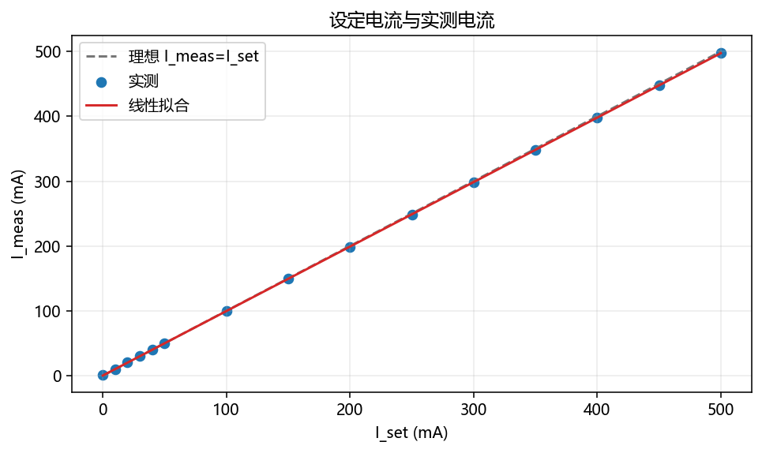
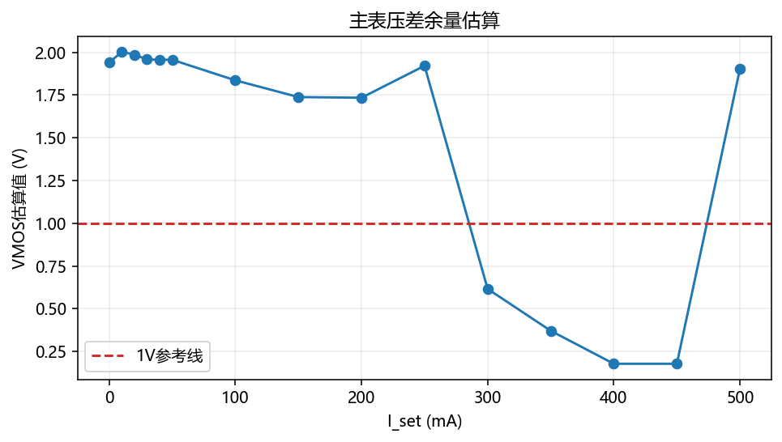

# 高精度数控恒流源

<p align="center">
  
  
  
  
  
  
</p>

<p align="center">
  该仓库为 <strong>做的都队</strong> 的 2026 校赛项目仓库。<br/>
  项目目标是实现一套由 <code>STM32 + DAC8562 + OPA197 + 可调 Buck</code> 协同工作的高精度数控恒流源系统。
</p>

## 项目简介

本项目围绕“高精度数控恒流源”展开，仓库内已经沉淀了方案设计、PCB 工程、STM32 固件、串口屏联调资料、测试记录、测试图表和参考工程。  
当前方案采用“**硬件恒流内环 + 软件余量外环**”的结构：

- 模拟恒流内环负责快速稳流。
- MCU 通过 DAC8562 设定目标电流并采样关键节点电压。
- 可调 Buck 由软件慢速调节输出余量，降低 MOS 管压降和发热。
- 串口屏、按键和编码器负责交互，串口遥测用于调试与状态输出。

## 系统架构

### 电源树

```text
35V 输入
├── 可调 Buck：输出 VOUT+，给负载和低边 MOS 恒流功率级供电
└── 固定 Buck：输出 5V
    ├── 串口屏
    ├── OPA197 运放
    └── LDO：输出 3.3V
        ├── STM32F103
        ├── DAC8562
        ├── TS5A3159A 模拟开关
        └── ADC / 比较器相关小信号电路
```

### 控制链路

```text
用户设定 Iset
    ↓
STM32 计算目标值并通过 DAC8562 CH2 输出电流参考
    ↓
OPA197 + MOS + Rs 构成硬件恒流环
    ↓
STM32 采样 Vsense / VOUT+ / VOUT-，计算 Iactual / Vload / VMOS
    ↓
STM32 通过 DAC8562 CH1 慢速调节可调 Buck 输出余量
```

### 三层控制职责

| 层级 | 主要器件 | 主要作用 | 响应特性 |
| --- | --- | --- | --- |
| 硬件恒流环 | OPA197、MOS、采样电阻 | 直接稳定输出电流 | 毫秒级或更快 |
| Buck 余量控制环 | STM32、DAC8562 CH1、Buck | 调节 VOUT+，控制 MOS 压降 | 约 50 到 200 ms |
| 显示与保护层 | STM32 ADC、串口屏、按键 | 显示、保护、状态管理、校准 | 由软件周期决定 |

## 当前实现进展

结合当前仓库中的固件、文档和测试记录，项目已经不只是概念设计阶段，已经完成了以下基础联通：

- 已形成完整方案文档，覆盖系统结构、保护逻辑、器件说明和 PCB 布局原则。
- `代码/成品/` 已接入 `ADC + DMA`、`SPI DAC`、按键、旋转编码器、串口屏初始化和周期性全局遥测输出。
- 当前固件内已经使用测试拟合得到的电流校准公式，将设定电流反推到 `DAC2_cmd`。
- 已积累两批恒流测试数据，并生成了线性拟合、误差、稳定性和压差余量图。
- 串口屏联调资料和命名约定已经整理，可继续推进 HMI 页面与 MCU 协议联调。

## 关键参数

| 项目 | 当前记录 |
| --- | --- |
| 采样电阻 | `Rs = 2Ω`，建议 0.1%、低温漂、2W 以上 |
| 电流关系 | `Iout = DAC_ISET / 2Ω` |
| 过流阈值 | `Vsense > 1.10V`，约等于 `Iout > 550mA` |
| 可调 Buck 近似关系 | `VOUT ≈ 30.98 - 10 × VDAC_CH1` |
| MOS 余量定义 | `VMOS = VOUT- - Vsense` |
| 当前余量目标 | 建议控制在约 `1.5V ~ 4V` |
| 负载电压 | `Vload = VOUT+ - VOUT-` |
| 负载估算 | `Rload = Vload / Iout` |

## 测试结论速览

`测试/恒流源测试/测试分析/测试数据02分析.md` 中已经给出了比较完整的量化结论，目前可以直接提炼出几条核心信息：

- `I_set -> I_meas` 主链路线性很好，去掉 `0mA` 点后拟合 `R² = 0.99999900`。
- `DAC2_meas -> I_meas` 极其线性，说明模拟恒流内环本身质量不错。
- `500mA` 点误差约 `-0.5%`，已经贴近常见赛题精度边界。
- 串口电流显示和 `VOUT+ / VOUT-` 显示仍建议继续做一次校准。
- `300mA ~ 450mA` 一些工况下 `VMOS` 余量不足，后续重点是优化 Buck 目标电压策略。

### 部分测试图

<p align="center">
  
  
</p>

## 仓库导航

| 路径 | 内容 |
| --- | --- |
| `方案说明.md` | 项目总体方案、控制逻辑、保护策略、器件与 PCB 设计原则 |
| `规划/` | 初期规划和中期报告模板 |
| `赛题/` | 校赛赛题原文 |
| `代码/成品/` | 当前主固件实现，含 ADC、DAC、按键、编码器、串口屏相关代码 |
| `代码/成品2/` | 另一套成品代码目录，适合后续对比与迁移 |
| `代码/测试板/` | 早期测试板工程 |
| `PCB/测试板/` | 立创 EDA 测试板工程 |
| `串口屏/` | 陶晶驰串口屏协作笔记、开发手册和例程 |
| `测试/恒流源测试/` | 恒流源测试规划、测试记录、分析报告和图表 |
| `测试/恒压源测试/` | 更早期的恒压/Buck 联调记录 |
| `数据手册/` | DAC、Buck、LDO 等核心器件数据手册 |
| `参考工程/` | 参考资料、BOM、接口文档和外部工程压缩包 |
| `github协作指南/` | 团队 GitHub 协作和 SSH 配置说明 |

## 固件侧当前可见功能

从 `代码/成品/` 的现状看，当前软件架构已经具备后续继续迭代的骨架：

- `main.c` 已完成外设初始化，并在主循环中运行按键、编码器、滤波和状态输出流程。
- `dsp_DAC.c` 已封装 DAC8562 的 SPI 控制和双通道电压输出。
- `dsp_ADC.c` 已实现 ADC 校准、双 ADC 启动、DMA 采样和基础滤波框架。
- `key_service.c` 已接入编码器与按键业务，支持调节电流目标和 Buck 控制通道。
- `dsp_test_communication.c` 已输出系统遥测信息，并向串口屏同步关键测量值。

## 建议阅读顺序

1. 先看本 README，快速了解项目结构和当前阶段。
2. 再看 `方案说明.md`，建立对系统方案和保护逻辑的整体理解。
3. 接着看 `测试/恒流源测试/测试分析/测试数据02分析.md`，把握当前真实测试结果。
4. 需要继续固件联调时，优先查看 `代码/成品/` 与 `串口屏/陶晶驰串口屏协作笔记.md`。
5. 需要查器件细节时，再回到 `数据手册/` 和 `参考工程/`。

## 调试提醒

1. 使能 `BUCK_EN` 前，必须确认 `DAC_CH1` 不在危险输出区间，避免可调 Buck 直接冲高。
2. 初期联调建议继续从低输入电压、低目标电流、低功率负载开始，不直接上满量程。
3. 在自动余量控制完全稳定前，优先验证手动 Buck、恒流环、ADC 校准和保护逻辑。
4. 若后续追求比赛精度，建议继续补测低电流段、纹波和显示校准数据。

## 团队说明

本仓库由 **做的都队** 用于比赛协作、硬件设计、代码联调与测试归档。  
README 头图已放在 `assets/readme-team-banner.png`，后续如果你们想继续统一展示风格，可以直接沿用这一套视觉做答辩材料或项目封面。
