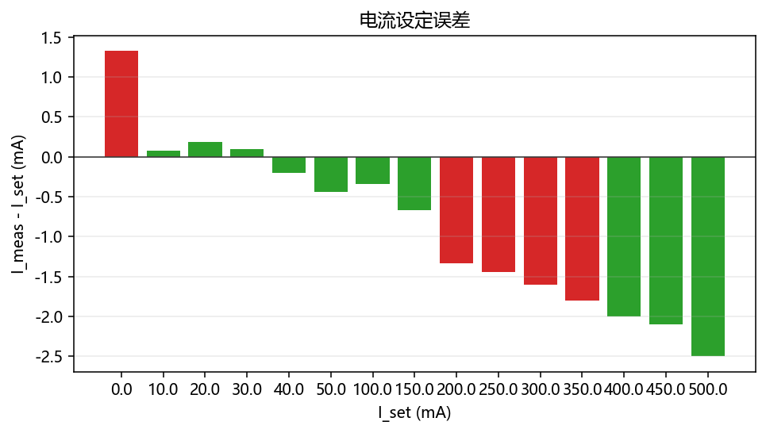
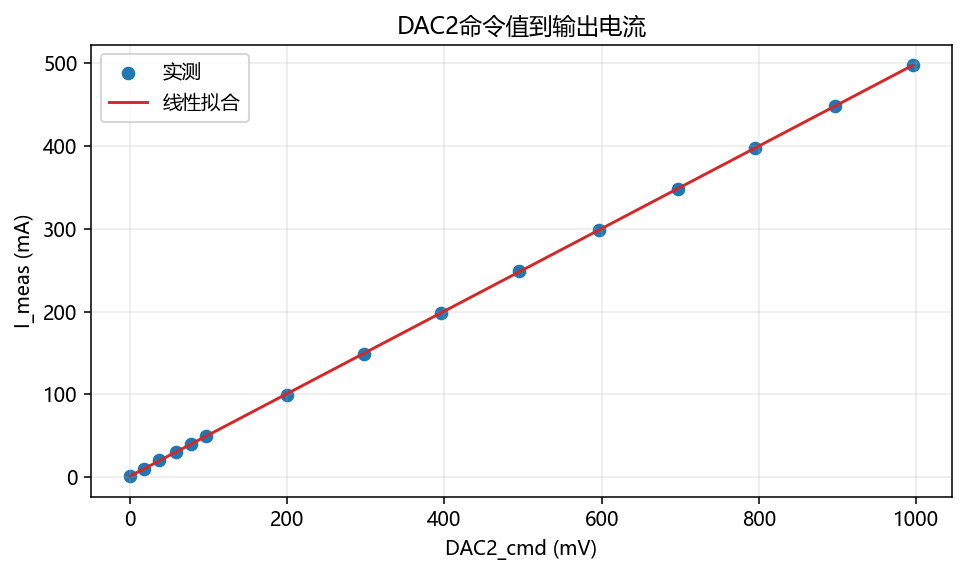
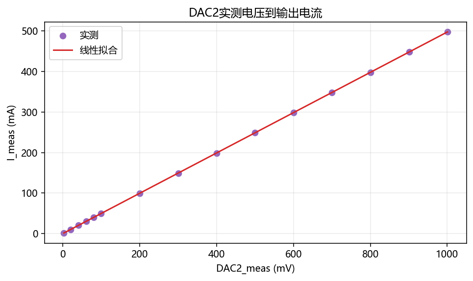
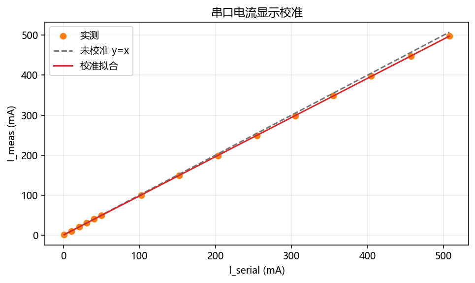
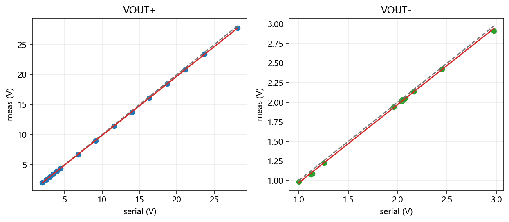
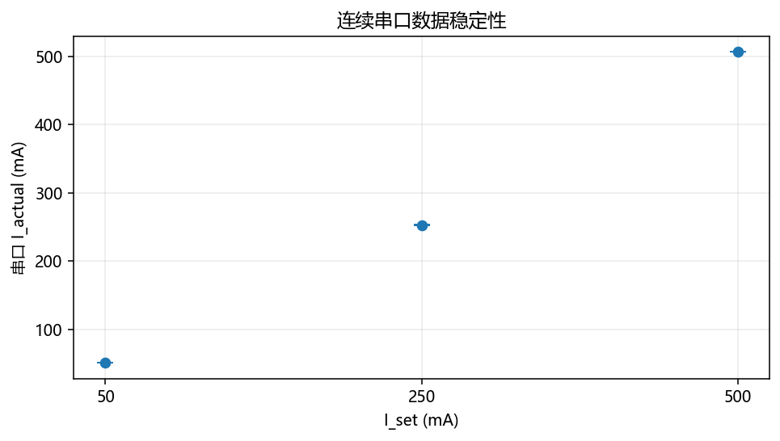
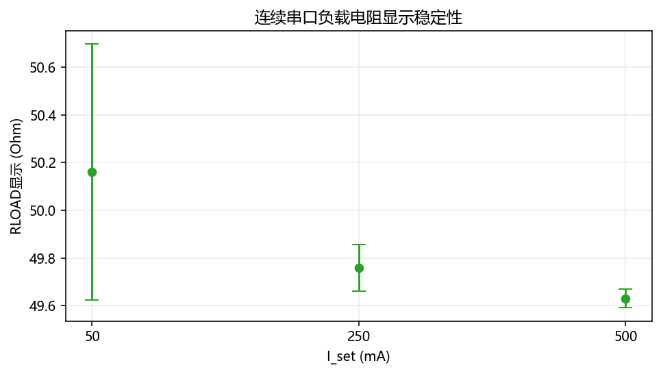
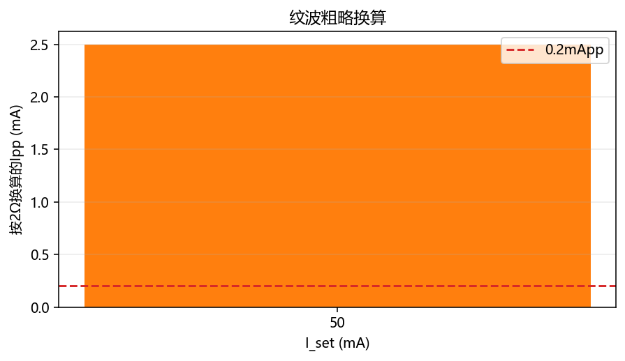

# 恒流源测试数据02分析报告

## 1. 数据来源与总体判断

本次分析基于 `测试记录/测试数据02.xlsx`，主要包含三类数据：

- 综合校准表：`0~500mA` 的设定电流、实测电流、DAC2 命令值、DAC2 实测值、串口显示电流、VOUT+ / VOUT- 显示与实测；
- 连续串口数据：约 `50mA`、`250mA`、`500mA` 三档的连续打印数据；
- 纹波表：目前只记录了 `50mA` 档的示波器读数。

总判断是：**电流控制主链路已经基本可用，模拟恒流内环线性非常好；后续重点应放在 DAC2 命令校准、电流显示校准、VOUT± 显示校准、BUCK 压差余量管理和纹波测量方法。**

所有图像由 `测试分析/generate_test_data02_figures.py` 使用 `D:\envs\torch_env\python.exe` 生成，输出到 `../figures` 目录。

## 2. 设定电流到实测电流

综合校准表中，设定电流 `I_set` 与电流表实测电流 `I_meas` 的线性拟合为：

```text
I_meas_mA = 0.994172 * I_set_mA + 0.259333
R² = 0.99999586
RMSE = 0.340 mA
最大拟合残差 = 1.071 mA
```

若去掉 `0mA` 点后再拟合：

```text
I_meas_mA = 0.994738 * I_set_mA + 0.067706
R² = 0.99999900
RMSE = 0.165 mA
最大拟合残差 = 0.345 mA
```


误差统计如下：

```text
平均绝对误差 = 1.075 mA
最大绝对误差：I_set = 500mA, I_meas = 497.5mA, 误差 = -2.5mA, 相对误差 = -0.5%
去掉0mA后最大相对误差：I_set = 20mA, I_meas = 20.19mA, 相对误差 = 0.95%
```



结论：高电流段已经贴近题目常见的 `±0.5%` 边界，`500mA` 点刚好为 `-0.5%`。低电流段相对误差看起来偏大，但绝对误差只有 `0.1~0.4mA` 量级，主要受零点偏置、仪表分辨率和低电流测量噪声影响。

## 3. DAC2 命令值到输出电流的校准公式

综合表中 `DAC2_cmd` 是固件给 DAC2 的命令电压，`I_meas` 是电流表实测电流。拟合结果为：

```text
I_meas_mA = 0.498188 * DAC2_cmd_mV + 1.368386
R² = 0.99999534
RMSE = 0.361 mA
最大拟合残差 = 0.848 mA
```



因此固件中可以把目标电流反算为 DAC2 命令值：

```c
DAC2_cmd_mV = (I_set_mA - 1.3684f) / 0.49819f;
```

这个公式比直接使用理想关系更贴合当前硬件和软件输出链路。需要注意的是，`0mA` 点实测仍有约 `1.33mA`，如果比赛指标特别看重低电流，建议单独补测 `0mA、5mA、10mA、20mA` 并做低电流段校准或零点扣除。

## 4. DAC2 实测电压到输出电流

本次数据补充了 `DAC2_mea_mV`，它比 `DAC2_cmd` 更能直接反映模拟恒流环的输入参考。拟合结果为：

```text
I_meas_mA = 0.497253 * DAC2_mea_mV - 0.029041
R² = 0.99999994
RMSE = 0.041 mA
最大拟合残差 = 0.090 mA
```



理论上，DAC2 经 `330Ω` 串联电阻和 `49.9kΩ` 到地电阻后送入运放正输入端：

```text
Vref_i = VDAC2 * 49.9k / (49.9k + 330)
Iout = Vref_i / Rsense
```

若 `Rsense = 2Ω`，则：

```text
Iout_mA = VDAC2_mV * 0.993430 / 2
Iout_mA ≈ 0.496715 * VDAC2_mV
```

实测斜率 `0.497253mA/mV` 与理论 `0.496715mA/mV` 非常接近。这说明：**只要 DAC2 的实际输出电压确定，运放 + MOS + 采样电阻这条模拟恒流内环非常线性。** 当前误差更多来自 `DAC2_cmd -> DAC2_meas` 的输出误差，以及串口/ADC 显示链路的换算误差。

## 5. 电流串口显示校准

串口显示电流 `I_serial` 相比电流表实测值整体偏高。拟合结果为：

```text
I_meas_mA = 0.980222 * I_serial_mA + 0.023329
R² = 0.99999018
RMSE = 0.524 mA
最大拟合残差 = 1.105 mA
```

去掉 `0mA` 点：

```text
I_meas_mA = 0.980490 * I_serial_mA - 0.069168
R² = 0.99999003
RMSE = 0.521 mA
```



可以先使用全量数据拟合式做显示校准：

```c
I_disp_mA = 0.98022f * I_serial_mA + 0.023f;
```

例如 `500mA` 点：

```text
I_serial = 507.667mA
校准后 I_disp ≈ 497.65mA
电流表 I_meas = 497.5mA
```

结论：电流显示偏高不是随机波动，而是比例系数偏差。加入这条一次校准后，串口/OLED 显示会明显贴近电流表。

## 6. VOUT+ / VOUT- 显示校准

VOUT 显示链路的拟合结果如下：

```text
VOUTP_meas_V = 0.985864 * VOUTP_serial_V + 0.001825
R² = 0.99998807
RMSE = 0.0284 V
最大拟合残差 = 0.0616 V
```

```text
VOUTN_meas_V = 0.998639 * VOUTN_serial_V - 0.026753
R² = 0.99940035
RMSE = 0.0128 V
最大拟合残差 = 0.0312 V
```



从原始显示误差看：

```text
VOUT+ 串口显示最大原始误差 ≈ 0.376 V
VOUT- 串口显示最大原始误差 ≈ 0.062 V
```

建议固件中先按下式修正显示值，再计算 `Vload`、`Rload` 和 `VMOS`：

```c
VOUTP_cal = 0.985864f * VOUTP_serial + 0.001825f;
VOUTN_cal = 0.998639f * VOUTN_serial - 0.026753f;
```

如果不校准 VOUT+，负载电阻和 MOS 压差的显示都会被 VOUT+ 偏高带偏。

## 7. 压差余量与 DAC1 设置

串口日志中的压差定义可按以下关系理解：

```text
VMOS = VOUT_N - Vsense
Vsense ≈ Iout * Rsense
Vload = VOUT_P - VOUT_N
```

综合表用 `VOUTN_meas - Vsense_serial` 估算主表压差，结果如下：


关键点为：

| I_set(mA) | I_meas(mA) | VOUTN_meas(V) | Vsense_serial(mV) | VMOS估算(V) |
| --- | --- | --- | --- | --- |
| 250 | 248.56 | 2.426 | 505 | 1.921 |
| 300 | 298.40 | 1.222 | 606 | 0.616 |
| 350 | 348.20 | 1.076 | 705 | 0.371 |
| 400 | 398.00 | 0.985 | 807 | 0.178 |
| 450 | 447.90 | 1.087 | 909 | 0.178 |
| 500 | 497.50 | 2.913 | 1011 | 1.902 |

`300~450mA` 的 `VMOS` 明显偏低，尤其 `400mA`、`450mA` 只有约 `0.18V`。这不是 MOS 发热导致的压差下降，而是 BUCK 输出电压余量给低了。

以 `450mA`、约 `49.6Ω` 负载为例：

```text
负载电压 ≈ 0.4479A * 49.6Ω ≈ 22.22V
Vsense ≈ 0.909V
若希望 VMOS ≈ 2V，则 VOUT+ 目标应约为：
VOUT+ ≈ Vload + Vsense + VMOS ≈ 22.22 + 0.909 + 2.0 = 25.13V
```

而表中实测：

```text
VOUT+ = 23.417V
VOUT_N = 1.087V
Vsense = 0.909V
VMOS ≈ 0.178V
```

这说明 `300~450mA` 那几行 DAC1 / BUCK 输出目标很可能仍按较低负载电压估算，切到约 `49.6Ω` 负载后余量不够。`500mA` 点 VOUT+ 提高到 `27.724V`，VMOS 又回到约 `1.90V`，也印证了这一点。

建议 DAC1 / BUCK 输出目标按下式估算：

```text
VOUTP_target = I_set * Rload_est + I_set * Rsense + VMOS_margin
```

其中：

```text
Rload_est：建议使用校准后的 Vload/Iout 得到
Rsense：约 2Ω
VMOS_margin：建议初版取 1.5~2.0V
```

## 8. 连续串口数据稳定性

`Sheet1` 中三段连续串口数据分别对应约 `50mA`、`250mA`、`500mA`。解析统计如下：

| I_set(mA) | 样本数 | I_actual均值(mA) | I_actual标准差(mA) | Vsense均值(mV) | Vsense标准差(mV) | RLOAD均值(Ω) | RLOAD标准差(Ω) | VMOS均值(mV) |
| --- | ---: | ---: | ---: | ---: | ---: | ---: | ---: | ---: |
| 50 | 29 | 51.023 | 0.447 | 97.793 | 0.412 | 50.161 | 0.537 | 1920.4 |
| 250 | 30 | 252.685 | 0.377 | 501.900 | 0.305 | 49.759 | 0.097 | 2346.5 |
| 500 | 31 | 506.804 | 0.301 | 1009.742 | 0.514 | 49.631 | 0.039 | 1924.4 |





结论：

- 电流显示重复性不错，三档标准差都小于 `0.5mA`；
- `50mA` 档的 `RLOAD` 显示波动较大，标准差约 `0.54Ω`，这是因为 `R = V/I` 在小电流时对电流噪声更敏感；
- `250mA` 和 `500mA` 档的负载显示已经比较稳，尤其 `500mA` 档 `RLOAD` 标准差约 `0.04Ω`。

显示滤波可以先按下面的思路实现：

```c
// 电流显示：响应稍快
I_disp = I_disp + 0.2f * (I_new - I_disp);

// 负载显示：响应更慢
Rload_disp = Rload_disp + 0.05f * (Rload_new - Rload_disp);
```

再加显示死区：

```text
Rload变化 < 0.3Ω 或 0.5Ω 时，不刷新显示
```

过流保护不要使用这么慢的显示滤波，仍应使用短平均或快速通道，并设置连续超限判据。

## 9. 纹波数据与测量方法

`Sheet2` 当前只记录了 `50mA` 档一项：

```text
I = 50mA
示波器读数 Vpp ≈ 5mV
若按 Rsense = 2Ω 直接换算：
Ipp ≈ 5mV / 2Ω = 2.5mApp
```



题目若要求电流纹波不超过 `0.2mA`，对应采样电阻上的电压纹波只有：

```text
0.2mA * 2Ω = 0.4mVpp
```

因此 `5mVpp` 不能直接说明真实电流纹波合格。但也要谨慎：这个读数很可能混入了 BUCK 高频尖峰、探头地线环路噪声、示波器带宽和接地方式误差，不能仅凭一次普通探头读数判定真实低频电流纹波。

建议重测步骤：

```text
1. 先做噪声底测试：
   探头尖端和地都接到 Rs 下端 / ADC_REF_GND，观察 Vpp。

2. 正式测量：
   探头尖端接 Rs 上端 / V_SENSE；
   探头地接 Rs 下端 / ADC_REF_GND；
   使用短地弹簧，不使用长地夹；
   打开 20MHz 带宽限制；
   使用 AC 耦合；
   同时观察 1us/div、10us/div、100us/div，不只看 ns 级尖峰。

3. 记录 Vpp 后换算：
   I_ripple_pp = Vpp / Rsense
```

如果噪声底本身已经有几 mV，就说明当前测量夹具不足以验证 `0.4mVpp` 级别的采样纹波。

## 10. 汇总结论

已经比较好的部分：

```text
1. I_set -> I_meas 主链路线性很好，500mA 点误差约 -0.5%。
2. DAC2_meas -> I_meas 极其线性，说明模拟恒流内环本身很好。
3. 连续串口数据重复性不错，I_actual 标准差均小于 0.5mA。
4. 500mA + 约50Ω 工况下，VOUT+ 能到 27.724V，VMOS 约 1.9V，高压差工况可以跑。
```

建议马上修改或补测的部分：

```text
1. 固件更新 DAC2 命令校准：
   DAC2_cmd_mV = (I_set_mA - 1.3684f) / 0.49819f;

2. 固件更新电流显示校准：
   I_disp_mA = 0.98022f * I_serial_mA + 0.023f;

3. VOUT+ / VOUT- 先校准，再计算 Rload 和 VMOS。

4. DAC1 / BUCK 输出目标要根据实际负载估计值和 VMOS_margin 计算，避免 300~450mA 这种压差塌陷。

5. 纹波需要按短地、限带、噪声底测试的方法重测；目前 5mVpp 只能作为粗略风险提示，不能作为最终纹波结论。
```

一句话总结：**今天的数据说明电流控制主链已经接近成品状态；最大风险已经从“能不能恒流”转移到“显示准不准、余量够不够、纹波怎么测准”。**
