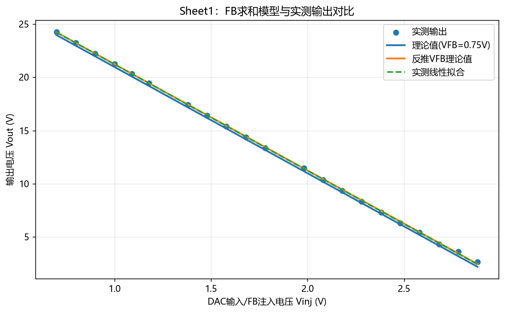
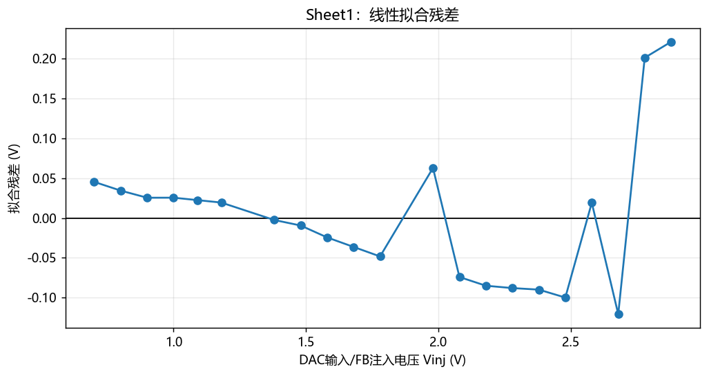
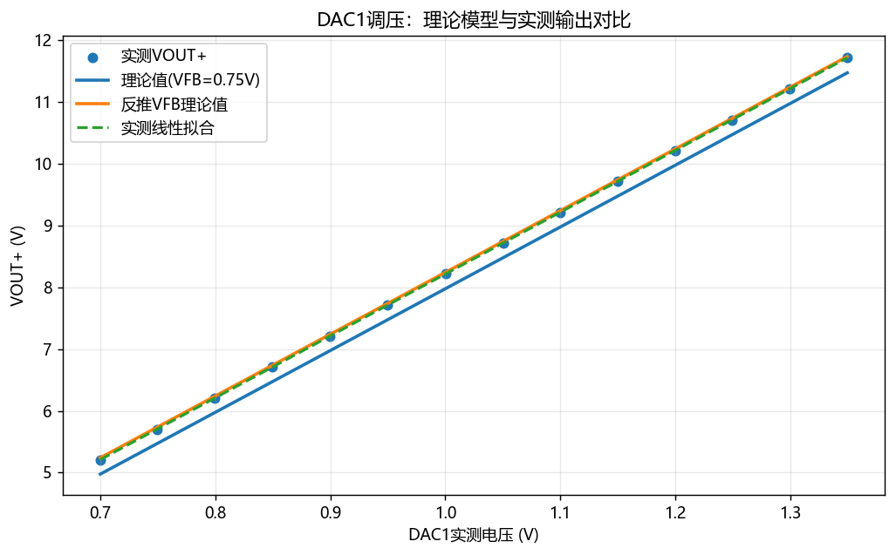
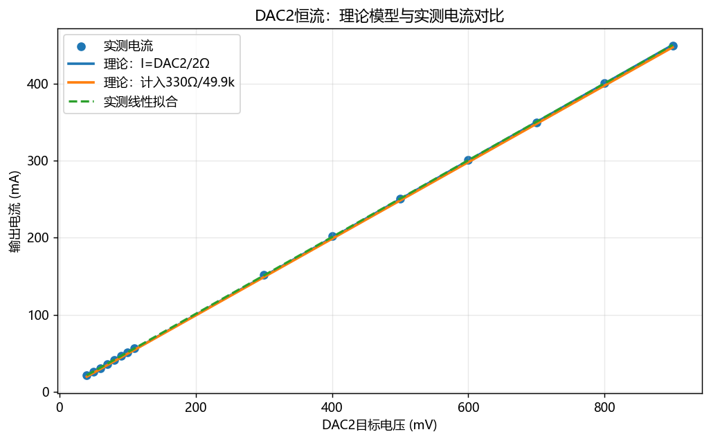
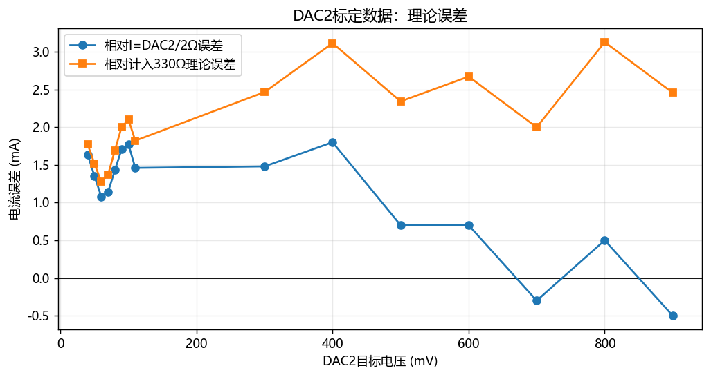
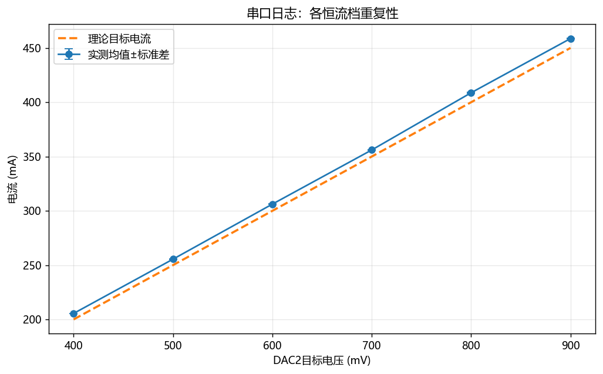
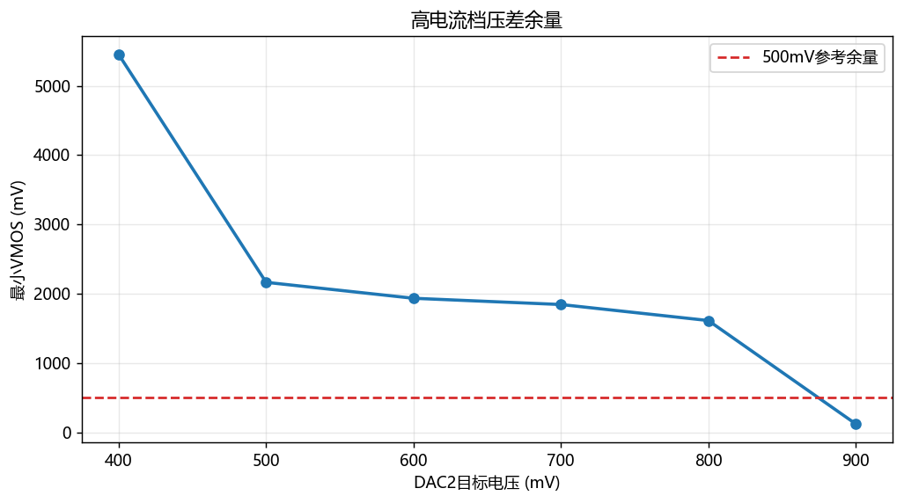

# 恒流源测试数据01分析报告

## 1. 电路工作链路概述

从原理图看，系统由控制板和功率/模拟板组成。输入电源经保护和滤波后产生 `VBUS/VBUS_FILT`，一路固定 BUCK 产生 `+5V`，再由 LDO 产生 `3V3`；另一路可调 BUCK 产生 `VOUT+`。控制板通过 SPI 驱动 `MCP4822` 双通道 DAC，其中：

- `DAC_CH1` 参与可调 BUCK 的 FB 求和节点，决定输出电压上限/工作点；
- `DAC_CH2` 作为恒流参考，送入 `OPA197`，运放驱动 MOS 管，使采样电阻电压跟随参考；
- `ADC_VOUT+ / ADC_VOUT- / V_SENSE` 回到 MCU，用于电压、电流和压差状态判断。

因此这个电源更准确地说是：**BUCK 提供可调电压余量，运放+MOS+采样电阻形成恒流闭环，MCU/DAC 给定目标值。**

从控制结构上看，它不是单纯靠 BUCK 闭环直接恒流，而是两级控制：

```text
DAC1 -> 可调BUCK反馈节点 -> 决定VOUT+可用电压余量
DAC2 -> 运放恒流参考 -> MOS线性调整 -> 决定负载电流
```

这个结构的优点是恒流环可以由模拟运放快速闭合，MCU 只需要给 DAC 目标值；缺点是 MOS 上必须保留足够压差，BUCK 输出电压设得太低时恒流环会进入饱和。

## 2. 可调 BUCK 反馈节点理论公式

原理图中可调 BUCK 的 FB 节点连接：

- `R21 = 100kΩ`：从 `VOUT+` 到 FB；
- `R20 = 3.3kΩ`：从 FB 到 GND；
- `R22 = 10kΩ`：从控制注入电压 `Vinj` 到 FB；
- LMR16030 的 FB 稳态电压记为 `Vfb`，典型值约 `0.75V`。

对 FB 节点列 KCL：

```text
(Vout - Vfb)/R21 + (Vinj - Vfb)/R22 + (0 - Vfb)/R20 = 0
```

整理得：

```text
Vout = Vfb * (1 + R21/R20 + R21/R22) - (R21/R22) * Vinj
```

这里的物理含义是：

- `R21/R20` 决定普通 BUCK 分压反馈的基础放大倍数；
- `R21/R22` 决定外部控制电压对输出电压的调制增益；
- 因为 `Vinj` 项前面是负号，所以注入电压升高会让 BUCK 输出下降；
- 只要 FB 节点输入电流很小，且 BUCK 能正常闭环，这个线性求和模型就成立。

代入原理图阻值：

```text
1 + R21/R20 + R21/R22 = 41.3030
R21/R22 = 10.0000
Vout = 41.3030 * Vfb - 10 * Vinj
```

若取 `Vfb = 0.75V`：

```text
Vout ≈ 30.9773 - 10 * Vinj
```

由 Sheet1 实测截距反推：

```text
Vfb_eff = 31.241957 / 41.3030 = 0.756408 V
```

这与 `0.75V` 典型值接近，说明 FB 求和模型与原理图吻合。





Sheet1 实测拟合：

```text
Vout = -10.010538 * Vinj + 31.241957
R² = 0.99983856
最大残差 = 0.221 V
平均绝对残差 = 0.065 V
```

结论：斜率理论值为 `-10`，实测为 `-10.0105`，非常接近；截距对应的 FB 等效参考约 `0.7564V`。

## 3. DAC1 到输出电压的正向调压关系

在 Sheet2 的 DAC1 标定中，输出随 `DAC1_actual` 增大而增大。结合前面的反向 FB 注入公式，可以理解为运放/控制级使：

```text
Vinj ≈ 3.3V - VDAC1
```

这个关系来自硬件上 `DAC_CH1` 经运放和电阻网络参与 FB 控制。若运放工作在线性区，且它把 DAC1 转换成相对于 `3V3` 的反向控制量，那么 DAC1 越高，实际送入 FB 求和节点的 `Vinj` 越低；由于 `Vout` 对 `Vinj` 的系数是 `-10`，最终表现为 DAC1 越高，`VOUT+` 越高。

代入 FB 求和公式：

```text
Vout = 10 * VDAC1 + (41.3030 * Vfb - 33)
```

使用反推 `Vfb_eff = 0.756408V`：

```text
Vout ≈ 10 * VDAC1 -1.7580
```

实测拟合：

```text
Vout = 10.012879 * VDAC1(V) -1.797554
R² = 0.99999995
最大残差 = 0.000898 V
```



结论：DAC1 每增加 `100mV`，输出电压约增加 `1.001V`。实测斜率与理论 `10V/V` 基本一致，说明可调 BUCK 的 DAC 控制链路线性很好。DAC1 本身最大实测误差约 `0.900mV`。

这组结果也说明目前 DAC1 控制输出电压的主要误差不是线性误差，而更可能来自：

- LMR16030 FB 参考电压的实际值与典型值偏差；
- DAC1 输出零点/满量程误差；
- 运放输出摆幅、输入失调和电阻精度；
- 测量仪表或采样换算的小偏差。

## 4. DAC2 恒流理论公式

恒流环中，`DAC_CH2` 经 `R1=330Ω` 串联后，节点由 `R6=49.9kΩ` 到 AGND，并经 `C5` 滤波送入 `OPA197` 正输入端。理想情况下，运放调节 MOS 管，使采样电阻电压等于该参考电压：

```text
Vref_i = VDAC2 * 49.9k / (49.9k + 330)
Iout = Vref_i / Rsense
```

若 `Rsense = 2Ω`：

```text
Iout = VDAC2 * 0.993430 / 2Ω
```

硬件上运放闭环的目标可以理解为：

```text
V+ = Vref_i
V- = Vsense = Iout * Rsense
运放调节MOS栅极，直到 V- ≈ V+
```

所以理想恒流值只由 `DAC2参考电压 / 采样电阻` 决定。MOS、负载和 BUCK 输出电压主要决定“能不能达到这个电流”，而不是理想电流公式本身。也就是说，只要 MOS 未饱和、运放未饱和、BUCK 电压余量足够，恒流公式应当成立。

用 `mV` 和 `mA` 表示：

```text
Iout(mA) ≈ 0.496715 * DAC2(mV)
```

如果忽略 `330Ω` 与 `49.9kΩ` 的轻微分压，则近似为：

```text
Iout(mA) ≈ 0.5 * DAC2(mV)
```

实测拟合：

```text
Iout = 0.498058 * DAC2_Target(mV) +1.685285
R² = 0.99999300
最大拟合残差 = 0.891 mA
```





DAC2 标定数据摘要：

| DAC2目标(mV) | DAC2实测(mV) | 理论电流(mA) | 实测电流(mA) | 误差(mA) |
| ------------ | ------------ | ------------ | ------------ | -------- |
| 900          |              | 450.00       | 449.50       | -0.50    |
| 800          |              | 400.00       | 400.50       | 0.50     |
| 700          |              | 350.00       | 349.70       | -0.30    |
| 600          |              | 300.00       | 300.70       | 0.70     |
| 500          |              | 250.00       | 250.70       | 0.70     |
| 400          |              | 200.00       | 201.80       | 1.80     |
| 300          |              | 150.00       | 151.48       | 1.48     |
| 110          | 113.65       | 55.00        | 56.46        | 1.46     |
| 100          | 104.20       | 50.00        | 51.77        | 1.77     |
| 90           | 94.00        | 45.00        | 46.71        | 1.71     |
| 80           | 83.38        | 40.00        | 41.43        | 1.43     |
| 70           | 72.74        | 35.00        | 36.14        | 1.14     |
| 60           | 62.55        | 30.00        | 31.08        | 1.08     |
| 50           | 53.03        | 25.00        | 26.35        | 1.35     |
| 40           | 43.53        | 20.00        | 21.64        | 1.64     |

结论：DAC2 到输出电流的线性很好，但存在正偏差。相对于 `I=DAC2/2Ω` 的简单理论，平均绝对误差约 `1.171mA`，最大约 `1.800mA`。这说明主要问题不是非线性，而是零点/比例系数/采样链路存在系统偏置。

从硬件角度看，偏高可能来自以下几类来源：

- `Rsense` 实际值小于标称 `2Ω`，同样的采样电压会对应更大的真实电流；
- DAC2 输出或运放输入端存在正向零点偏移；
- 运放输入失调被直接等效成采样电阻上的电压误差，例如 `10mV` 失调在 `2Ω` 上就是 `5mA`；
- MCU/串口打印中的电流计算使用了理想 `2Ω`，但实际采样电阻、ADC基准或增益没有校准；
- 采样地 `AGND/ADC_REF_GND/GND` 回流导致毫伏级地电位差，这在 `2Ω` 采样上会直接变成毫安级电流误差。

目前偏差量级约 `5~9mA`，折算成采样电阻电压约 `10~18mV`，这个量级很像零点、地线压降、运放失调叠加后的系统误差。

## 5. 输出电压采样公式

原理图中 `VOUT+` 与 `VOUT-` 均通过 `330kΩ/33kΩ` 分压进入 ADC，并在 ADC 前串 `1kΩ`、并 `22nF` 做低通滤波。理想分压比为：

```text
Vadc = Vin * 33k / (330k + 33k) = Vin / 11
Vin = 11 * Vadc
```

因此负载两端电压可由差分方式重构：

```text
Vload = 11 * (ADC_VOUT+ - ADC_VOUT-)
```

串口日志中 `Vload` 与 `VOUT_P - VOUT_N` 基本一致，说明这条采样链路的公式方向是正确的。这里采用高阻分压，优点是损耗小；缺点是 ADC 输入源阻抗较高，因此 `1k + 22nF` 滤波、电容漏电、ADC采样时间都会影响精度。若后续追求更高精度，建议检查 ADC 采样周期是否足够长。

## 6. 串口日志恒流点与重复性

右侧串口日志解析出 18 条完整记录，每个电流档重复 3 次。统计如下：

| DAC2目标(mV) | 理论电流(mA) | 实测均值(mA) | 标准差(mA) | 平均误差(mA) | 最小VMOS(mV) |
| ------------ | ------------ | ------------ | ---------- | ------------ | ------------ |
| 400          | 200.0        | 205.509      | 0.077      | 5.509        | 5451         |
| 500          | 250.0        | 255.474      | 0.215      | 5.474        | 2166         |
| 600          | 300.0        | 306.173      | 0.308      | 6.173        | 1936         |
| 700          | 350.0        | 356.041      | 0.244      | 6.041        | 1846         |
| 800          | 400.0        | 408.728      | 0.350      | 8.728        | 1615         |
| 900          | 450.0        | 458.633      | 0.379      | 8.633        | 125          |



重复性很好：各档最大标准差约 `0.379mA`。这说明闭环在这些测试点下较稳定，误差主要表现为系统偏高，而不是随机抖动。

## 7. 压差余量分析

恒流环需要 MOS/调整级保留足够压差，否则运放即使继续驱动，也无法让采样电阻电压继续升高。串口日志中的 `VMOS` 可作为压差余量观察量。



在 `DAC2_Target = 900mV` 档：

```text
理论电流 ≈ 450mA
实测电流 ≈ 458.6mA
最小VMOS ≈ 125mV
```

这个压差已经很低，说明该负载约 `46Ω`、电流约 `459mA` 时接近调节边界。如果继续提高电流、提高负载阻值，或输入电压下降，恒流环可能进入饱和，表现为电流上不去、误差变大或波动增加。

从硬件能量路径看，负载电压约为：

```text
Vload ≈ Iout * Rload
```

调整级需要的余量近似为：

```text
VOUT+ >= Vload + VMOS_min + Vsense + 走线/器件余量
```

其中 `Vsense = Iout * Rsense`。当 `Rload≈46Ω`、`Iout≈459mA` 时，仅负载就需要约 `21.1V`，采样电阻还需要约 `0.918V`，再加上 MOS 调整余量，BUCK 输出必须足够高。现在测到的 `VMOS` 最低约 `125mV`，说明 DAC1 对应的 BUCK 输出电压已经贴近需求下限。

## 8. 综合判断

1. **可调 BUCK 的理论模型成立。** FB 求和方程给出的斜率为 `-10`，Sheet1 实测为 `-10.0105`，反推 FB 参考约 `0.7564V`。
2. **DAC1 调压链路线性极好。** `VOUT+` 与 `DAC1_actual` 的 R² 为 `0.99999995`，最大拟合残差仅 `0.000898V`。
3. **DAC2 恒流链路线性好但整体偏高。** 实测斜率 `0.498058mA/mV` 接近理论 `0.5mA/mV`，但截距约 `1.685mA`，实际电流普遍偏高。
4. **重复性优于绝对精度。** 同档三次重复标准差小于 `0.4mA`，说明可以通过软件标定显著改善绝对误差。
5. **高电流档受压差余量限制。** `900mV` 档最小 `VMOS` 只有约 `125mV`，建议提高 DAC1 电压余量或限制该负载下的最大恒流设定。

整体来看，这版硬件已经具备比较好的基础：电压调节链路线性非常好，恒流环重复性也好，说明原理设计方向成立。当前更像是“还没完成精密校准”和“高电流档余量需要管理”的阶段，而不是拓扑错误。

## 8.1 已获得与待补充的标定关系

本次测试已经确认或正在建立的关系如下：

1. `DAC1_Target` 与 `DAC1_actual` 的对应关系已经获得。当前数据中 DAC1 实测误差最大约 `0.900mV`，可以认为 DAC1 输出本身线性和一致性较好。
2. `DAC1_actual` 与 `VOUT+` 的标定公式已经获得：

```text
VOUT ≈ 0.010012879 * DAC1_actual(mV) - 1.797554
```

也可写成：

```text
VOUT ≈ 10.012879 * DAC1_actual(V) - 1.797554
```

3. `V_SENSE` 采样值换算出的电流与电流表实测电流之间，还需要进一步做线性校准。建议后续按以下形式拟合：

```text
I_meter = k_sense * I_sense_adc + b_sense
```

其中：

```text
I_sense_adc = V_SENSE / Rsense
```

如果 `Rsense = 2Ω`，则理想情况下：

```text
I_sense_adc(mA) = V_SENSE(mV) / 2
```

实测后用于固件补偿的形式可以写成：

```text
I_calibrated = k_sense * (V_SENSE / Rsense) + b_sense
```

或者反向求目标采样电压：

```text
V_SENSE_target = Rsense * (I_target - b_sense) / k_sense
```

这一项目前“公式形式已确定，系数还未最终计算”，需要下一组 `V_SENSE` 与电流表同步数据来完成。

## 9. 下一步测试建议

建议下一轮测试按“先拆链路，后闭环整机”的顺序做。

### 9.1 静态硬件参数复测

- 用四线法测量采样电阻实际值，记录温度下的阻值变化；
- 单独测 `DAC_CH1/DAC_CH2` 输出电压，覆盖低端、中点、高端，得到 DAC 零点和增益误差；
- 测 `OPA197` 恒流环输入两端电压差，确认稳定恒流时 `V+` 与 `V-` 的误差量级；
- 测 `AGND`、`ADC_REF_GND`、功率 `GND` 在不同电流下的电位差，判断地线压降是否进入采样链路；
- 核对 `330k/33k` 分压电阻实际值，计算 ADC 电压采样比例误差。

### 9.2 DAC1 电压余量测试

- 固定负载和恒流目标，扫 DAC1，记录 `VOUT+、Vload、VMOS、Iout`；
- 找出每个电流档刚好失去恒流的 DAC1 临界点；
- 建立软件中的最小输出电压策略，例如：

```text
VOUT_set >= I_target * Rload_est + I_target * Rsense + VMOS_margin
```

其中 `VMOS_margin` 建议先取 `0.5~1.0V` 做保守验证。

### 9.3 DAC2 恒流校准测试

- 在足够压差余量下测试 DAC2，例如每 `50mV` 或 `100mV` 测一点；
- 每个点至少记录 5 次，计算均值、标准差和温升后的漂移；
- 拟合一次线性校准：

```text
I_actual = k * DAC2 + b
DAC2_corrected = (I_target - b) / k
```

- 若残差出现弯曲，再考虑二次校准或分段线性校准。

### 9.4 动态与热测试

- 做负载阶跃测试，观察恒流恢复时间、过冲和振荡；
- 在 100mA、300mA、450mA 等档位各持续运行 10~30 分钟，记录电流漂移、MOS温度、采样电阻温度；
- 测输入电压从低到高变化时的电流保持能力，确认实际输入范围；
- 对最高功率点进行热成像或点温测试，重点看 MOS、采样电阻、BUCK电感和二极管。

### 9.5 本次测试注意事项

- 输入电源的限流建议设置为 `0.5A`。如果电源限流过低，系统从 CV 状态切换到 CC 状态时，输入电源可能进入限流，导致板上 `5V` 与 `3V3` 掉电波动，进而引发单片机复位。
- 本次使用的电位器/负载在约 `450mA`、`45Ω` 条件下已经接近或超过承受能力，出现发热烧毁风险。因此本次没有继续测 `500mA`。后续如需测试 `500mA` 档，应更换功率足够的负载，或调小负载电阻并重新核算功耗。
- 负载功耗按下式估算：

```text
Pload = I^2 * Rload
```

以 `450mA`、`45Ω` 为例：

```text
Pload = 0.45^2 * 45 ≈ 9.1W
```

因此普通小功率电位器不适合直接承受该测试点，建议使用大功率电阻、电子负载或多电阻并联分摊功耗。

## 10. 当前整体分析与建议

- 软件中对 DAC2 做一次线性校准，初步可用实测拟合反解：

```text
DAC2_Target_corrected = (I_target - 1.685285) / 0.498058
```

- 对 DAC1 输出电压也可保留拟合式用于预设电压余量：

```text
VOUT ≈ 0.010012879 * DAC1_actual(mV) -1.797554
```

- 高电流/高负载电压时，确保 `VMOS` 至少保留数百 mV，工程上建议先按 `>=500mV` 作为报警线，再结合实测温升和动态响应决定最终阈值。
- 复测采样电阻实际阻值、OPA197输入失调、DAC2零点、ADC换算系数，优先排查造成 `+5~9mA` 系统偏差的来源。
- 完成 `V_SENSE` 采样电流与电流表实测电流的线性校准后，应优先在固件中使用校准后的 `I_calibrated` 作为显示值和保护判断值。

对当前版本的总体评价：

- **原理可行性：通过。** 电压环和恒流环的实测趋势与原理公式一致；
- **线性：较好。** DAC1、DAC2 的拟合 R² 都非常高；
- **重复性：较好。** 恒流点三次重复标准差小，适合做软件标定；
- **绝对精度：需要校准。** 当前电流整体偏高，必须补偿零点和增益；
- **高功率余量：需要优化。** 900mV 档 `VMOS` 过低，应提高 BUCK 设定或限制该工作点；
- **下一版重点：采样链路和地线。** 毫伏级误差会直接变成毫安级电流误差，PCB回流和ADC参考地需要重点检查。

## 对于本报告的分析：

1. DAC1/Buck 线性很好，DAC1 预设公式可用。
2. DAC2→I_meas 线性很好，适合一次线性校准。
3. 串口重复性不错，说明显示波动不是主要矛盾；主要是显示偏差要校准。
4. 高电流+高负载下 VMOS 会塌，必须管理 Buck 余量。
5. 高电流测试时负载功率很大，不能用普通电位器硬扛。

##### 存疑结论：

1. “实测均值偏高 5~9mA”——要改名为 I_serial_avg 偏高，而不是 I_meas 偏高。
2. “偏差像运放失调/地线压降”——目前证据不够，优先怀疑 ADC显示链校准。
3. “下一步测试建议”全部做——太散，只取其中与 I_meas、I_serial、VOUTP/N 相关的部分。
