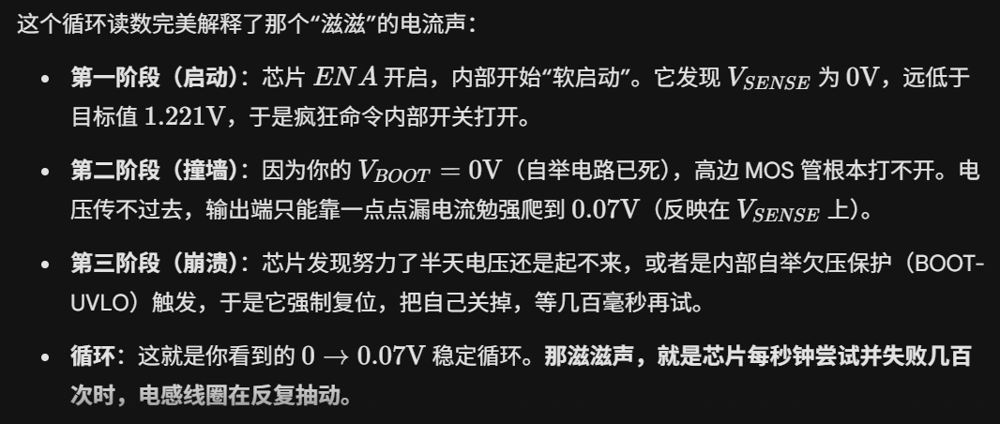

测试记录：

起因就是我想起昨晚后面都是用5V测，但是tps5450最低要求输入电压是5.5V，我就想着会不会boot0V是欠压的问题，就又来测了一下。（还有发现单片机跳线帽不是都在00，还在串口烧录状态，不知道昨晚有没有记得归位？）

我用10V给VIN，5V给5V端子、3.3V用杜邦线给3.3V的端子。然后接上去单片机和板子上的两个电源指示灯是正常亮，但是过30s到一分钟左右就闻到一缕焦香（），马上断电。测单片机的3.3和gnd是正常的，后面我测试都把单片机拔掉了。测降压芯片的电阻也都是正常的。

单片机应该没事，但下次可能要试下裸板烧个程序能不能成功，再确认下有没有问题（第三次测试中确认完毕没有问题）

然后VIN给7V，发现一用3.3V手动使能ena引脚，就有比较大的电流音（原因分析见下图）（7V也被gemini分析说电压不够可能会引起震荡什么的）然后换了12V的VIN电压，电流音小了很多但还有（和昨晚stlink那个差不多大），然后测电压是PH输出1.55V（方波平均值），boot输出为0（自举电路坏了），VESENSE从0-0.07V循环变化。

总之就是，找不到那个味道的来源，不知道是哪个芯片发出来的，是tps5450还是单片机还是什么。。。

我今晚都没测采样电路，希望那里的芯片不要出事(ㄒㄒ)但还是得再测一下

gemini给出的电流音解释如下：
