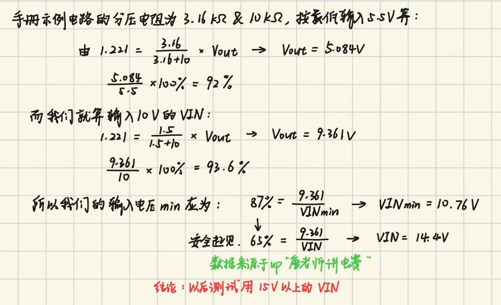

测试记录：

- 核心板插着（烧录的程序是无关的PC13LED测试程序）；VIN接10V输入，5V端子和3V3输入端口都不接输入，拿3V3电压给ENA引脚使能，发现有输出（8.6V）（莫名其妙就有输出了）

- 测试数据：

100Ω负载

| 输入电压/V | 输出电压/V | VESESE/V    |
|------------|------------|-------------|
| 10         | 8.6        | 1.2or1.12(? |
| 11         | 9.xx       | 1.2or1.12(? |
| 12         | 1.xx       | 0.2         |
| 15         | 1.55       | 0.2         |
| 20         | 2.xx       | 0.2         |
| 30         | 4.xx       | 0.4         |

- 换了0-100Ω的电位器负载，没记录具体数据，现象和之前没变化

- 观察到一个现象：用10VVIN，3V使能ena引脚。输出8.6V，看到boot引脚电压是慢慢上升，感觉用了半分多钟，最后稳定在16.87V（然而正常情况下充电是微秒级别的）

- 测了一下两个采样的接口，在10V输入、输出正常8.55V情况下，采样都为0，电压采样的运放的2、3脚都是合理的0.79V，判断故障可以锁定在运放芯片上，暂判断气味来源为运放芯片

**数据理解：**

在理想情况下，根据设定的分压电阻网络（1.5kΩ和10kΩ），反馈引脚（VSENSE）要达到内部基准电压 1.221V，根据分压公式 1.221 =VOUT\*1.5/（10+1.5），理论目标输出电压 VOUT应为 9.361V。若要在10V输入下达到此目标，理论上需要芯片提供93.6%的占空比。

然而，在实际运行中，输出电压受到了最大占空比限制与内部压降的双重制约：

首先，由于自举电容（C1）在每个周期都必须预留时间进行充电，芯片的最大占空比被物理限制在87%（来自tps5450数据手册）。若按87% 的极限占空比计算，10V输入能转换出的理论最高电压仅为8.7V。

其次，在这个 8.7V的基础上，扣除掉芯片内部及回路中的其他物理压降损耗后，最终实际的输出电压只能达到8.6（8.55）V。由于实际输出被卡在8.6V无法继续上升，可算出此时通过反馈网络分压后，实际送到 VSENSE 引脚的电压仅为1.12V。始终无法达到1.221V的稳压阈值，这也正是芯片在10V输入时只能处于极限“开环”挣扎状态的根本原因。

**前三次测试总体分析：**

- 输入电压下限是跟着分压电阻选择变的，不是5.5-36V。手册上写的5.5-36V，只是指逻辑控制电路正常开机的电压范围，但具体到我们的电路，由于改了分压网络，目标输出变成了9.36V，实际最小输入电压就已经被强行抬高了。

数学推导：

> 结论：以后测试用15V以上的VIN

- **关于自举电路（BOOT）如何损坏的猜测**

<!-- -->

- 第一次给的5V实际上不会损坏这个芯片，只是单纯不让它启动

- 第二次与第三次给10V，如前面计算的，由于输入达不到 10.76V（11V）的下限门槛，芯片被迫一直顶在89%的最大占空比极限运行，最终烧断了自举充电回路。

<!-- -->

- **VSENSE引脚0-0.7V的循环**

给10V时，由于输入电压不够，芯片一直顶在最大占空比（87%）。内部的主MOS管几乎处于“长通”状态，很少进行开关动作。虽然 BOOT 电路已经坏了（观察到充电需要30秒），但只要管子勉强导通，它就能像一个大电阻一样把电导过去，维持住8.6V。

但当输入提高到 12V、15V 及以上时，电压余量充足，芯片退出占空比受限状态，尝试以 500kHz 的频率进行 PWM 闭环稳压。由于 BOOT 充电回路已在之前的测试中受损，其无法在高频下为内部高侧 MOS 管提供足够的栅极驱动电压。

这导致 MOS 管无法完全导通，其等效导通内阻Rds_on急剧增大。TPS5450 是通过检测 MOS 管的漏源压降V_ds来实现过流限制的 。巨大的内阻使得哪怕是极小的负载电流，也会产生巨大的 V_ds 压降，从而“欺骗”芯片内部的过流保护（OCP）比较器，使其误认为输出发生了严重短路。

触发过流阈值后，芯片立刻启动了断续模式过流限制（Hiccup 模式），强制关断输出并等待约 16ms 后重试 。正是因为芯片在极短的导通后便进入了长达 16ms 的休眠期，其平均发热功率极低，因此在宏观上并未表现出高温发烫的现象，同时外在表现为输出电压崩溃（1.xxV 均值）和 0-0.07V 的循环打嗝。

- **气味来源猜测**

可能是第二次10V、12V输入导致主回路震荡时，产生了恶劣的电磁尖峰。这些尖峰电压逆向冲破了脆弱的 OPA2188 输出级，烧断了其内部的走线
