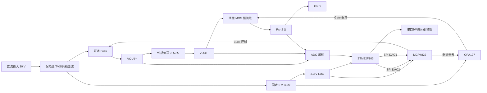
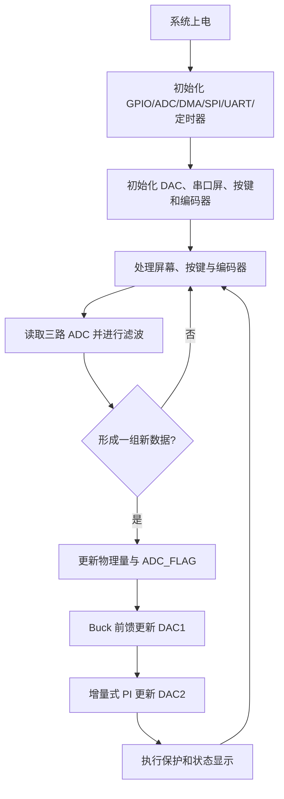

# 高精度数控恒流源系统设计、控制分析与测试报告

| 项目     | 内容                                                                                              |
| -------- | ------------------------------------------------------------------------------------------------- |
| 参赛队伍 | 做的都队                                                                                          |
| 参赛成员 | 邓嘉杰、刘欣雅、卢城霖                                                                            |
| 选题     | 选题三：高精度数控恒流源                                                                          |
| 项目仓库 | [https://github.com/sysuwilliam/NC-Current-Source](https://github.com/sysuwilliam/NC-Current-Source) |

---

## 摘要

本项目设计并实现了一套基于单片机控制的高精度数控恒流源。系统面向 `0～500 mA` 直流恒流输出需求，支持 `1 mA` 步进设定、输出电流和负载参数实时显示，并具有过流、短路和开路保护功能。为兼顾恒流精度、输出范围和功率器件温升，系统采用“**可调 Buck 预稳压 + 运放/MOS 线性恒流 + MCU 数字标定与控制**”的混合控制结构。

硬件以 STM32F103C8T6 为控制核心，MCP4822 双通道 DAC 分别产生恒流参考电压和 Buck 调节电压；OPA197、功率 MOS 管及 `2 Ω` 采样电阻构成快速模拟恒流内环；LMR16030 可调 Buck 根据设定电流和负载估计值调节 `VOUT+`，为 MOS 管保留约 `1.5 V` 的工作压差，从而在保证恒流能力的同时降低线性功率器件发热。STM32 同步采集 `VOUT+`、`VOUT-` 和 `V_SENSE`，完成电流、电压、负载阻值和 MOS 压差的计算，并通过均值滤波、卡尔曼滤波、线性校准及多点标定后的残差补偿提高显示精度。

测试结果表明，DAC2 实测电压与输出电流具有很高的线性度，关系为 `I_meas = 0.497253×DAC2_meas−0.029041`，决定系数达到 `R²=0.99999994`；设定电流与实测电流去除零点后决定系数为 `R²=0.99999900`。历史测试中 500 mA 点误差为 `−2.5 mA`，相对误差为 `−0.50%`；连续采样结果显示，50 mA、250 mA 和 500 mA 三档的显示标准差均小于 `0.5 mA`。最终系统完成 0～500 mA 数字设定、负载阻值显示、Buck 自动调压以及过流、短路和开路保护。串口屏除显示数值与状态外，还可实时绘制目标电流和实际电流双通道波形；项目同时完成了面向实物装配、散热和操作的三维外壳结构设计。

**关键词：** 数控恒流源；模拟负反馈；可调 Buck；数字校准；PI 控制；负载检测；STM32

---

## 1 项目背景与设计任务

### 1.1 项目背景

恒流源能够在负载阻值发生变化时维持输出电流基本不变，广泛应用于器件测试、LED 驱动、传感器激励、电化学测量和实验室电源等场景。传统模拟恒流源具有响应快、结构直观的优点，但设定方式单一、参数不易显示，且在宽负载范围下容易因功率管压差过大而产生明显发热；纯开关恒流方案效率较高，但开关纹波、闭环补偿和低电流精度控制难度较大。

本项目将线性恒流与开关预稳压相结合：快速模拟环负责稳定电流，低速数字环负责设定、校准、显示、保护和供电余量管理，使系统兼具高精度、宽负载范围和较低功耗。

### 1.2 设计任务

赛题要求设计并制作一台基于单片机控制的高精度数控恒流源，主要技术要求如下：

1. 输出电流范围为 `0～500 mA`，设定步进为 `1 mA`，精度要求为 `±0.5%`；
2. 当输出电流超过 `550 mA` 时能够自动切断，并显示设定电流和实际输出电流；
3. 在恒流模式下，负载电阻在 `0～50 Ω` 范围变化时，输出电流变化绝对值小于设定值的 `1%`；
4. 输出端短路时自动将电流限制在设定值，不损坏设备；
5. 负载开路时自动检测并报警；
6. 发挥部分要求输出纹波电流不大于 `0.2 mA`，并能够测量和显示负载电阻值。

### 1.3 设计指标与完成情况

| 指标         | 赛题要求                    | 系统设计与测试结果                                                                                     |
| ------------ | --------------------------- | ------------------------------------------------------------------------------------------------------ |
| 输出电流范围 | 0～500 mA                   | 实现 0～500 mA 数字设定，软件安全上限保留至 600 mA，正常使用限制在 500 mA                              |
| 设定步进     | 1 mA                        | 实现 1 mA、10 mA、100 mA 可切换步进，默认可使用 1 mA 精调                                              |
| 电流精度     | ±0.5%                      | 主链路线性良好；历史保守数据最大误差约为 500 mA 点 −0.50%，低电流区通过多点标定后的残差补偿进一步修正 |
| 负载范围     | 0～50 Ω                    | 模拟恒流环配合 Buck 自动调压，覆盖短路至约 50 Ω 负载                                                  |
| 负载变化     | 电流变化绝对值小于设定值 1% | 最终功能验证中负载变化满足设计要求                                                                     |
| 过流保护     | >550 mA 自动切断            | 设置 550 mA 阈值，触发后关闭 Buck 并锁存报警                                                           |
| 短路保护     | 限制在设定值                | 模拟恒流内环天然限流，Buck 前馈在低阻工况下降低功耗                                                    |
| 开路保护     | 自动检测并报警              | 根据设定电流、实际电流和输出状态检测并报警                                                             |
| 负载阻值显示 | 可测量并显示                | 由校准后的负载压降与输出电流计算，低电流区设置显示门限和强滤波                                         |
| 输出纹波     | ≤0.2 mA                    | 已建立采样电阻纹波测试方法；普通探头粗测受噪声底限制，详见 8.7 节                                      |

---

## 2 系统总体方案

### 2.1 总体设计思路

系统采用两块 PCB 分离设计：功率/模拟板负责输入保护、电源变换、恒流功率级和模拟采样；控制板负责 STM32、编码器、按键、串口通信与人机交互。板间通过排线传输 SPI、Buck 使能和 ADC 信号，能够降低功率开关噪声对数字控制和弱信号测量的影响，也便于分模块调试。

总体能量与控制流程如下：



### 2.2 方案比较与选择

#### 2.2.1 纯线性恒流方案

纯线性方案可由运放、MOS 管和采样电阻构成，结构简单、输出纹波低、恒流响应快，但 MOS 管承受的功耗为：

$$
P_{MOS}=V_{MOS}I_{out}
$$

当输入电压高、负载电压低或发生短路时，MOS 管压差明显增大，容易产生较高温升，不利于长期稳定运行。

#### 2.2.2 纯 Buck 恒流方案

纯开关恒流方案效率高，但要在 0～500 mA 全范围内同时满足低纹波、高精度和快速负载响应，需要复杂的电流模式控制和环路补偿，且开关节点噪声会增加 ADC 和显示校准难度。

#### 2.2.3 本项目混合方案

本项目由 Buck 粗调供电电压、线性环精调输出电流：

- OPA197 与 MOS 构成的模拟恒流环响应最快，直接承担负载扰动；
- DAC2 和数字 PI 负责设定与静态精度修正；
- DAC1 和 Buck 慢环只管理 MOS 压差，不参与高速电流调节。

这种分层控制使每个环路只处理适合自身带宽的问题，既避免 Buck 高频调节干扰电流，又显著降低 MOS 管长期功耗。

### 2.3 系统模块组成

| 模块       | 核心器件或参数                  | 主要作用                             |
| ---------- | ------------------------------- | ------------------------------------ |
| 主控模块   | STM32F103C8T6                   | 数据采集、控制计算、状态机和人机交互 |
| 双通道 DAC | MCP4822-E/SN                    | DAC1 控制 Buck，DAC2 产生恒流参考    |
| 模拟恒流环 | OPA197 + SUD50N06-09L-TP + 2 Ω | 快速建立并稳定输出电流               |
| 可调 Buck  | LMR16030                        | 输出 VOUT+，动态管理 MOS 压差和功耗  |
| 固定电源   | LMR16030 + SPX29302             | 产生 5 V 和 3.3 V 电源               |
| ADC 采样   | STM32 内部 ADC + 精密分压       | 采集 VOUT+、VOUT−、Vsense           |
| 人机交互   | 串口屏、EC11 编码器、按键       | 参数设置、数据显示和告警提示         |
| 输入保护   | 自恢复保险丝、TVS、共模电感     | 过流、浪涌和高频干扰抑制             |

---

## 3 硬件系统设计与工作原理

### 3.1 输入保护与电源树

系统测试时通常使用 24～30 V 直流输入，输入端依次设置自恢复保险丝、TVS 管、共模电感和大容量滤波电容。电源分为两路：

1. 一路经可调 LMR16030 输出 `VOUT+`，供负载和线性恒流功率级使用；
2. 另一路经固定 Buck 输出 5 V，供 OPA197 和串口屏使用，再通过 SPX29302 LDO 产生 3.3 V，供 STM32、MCP4822 和小信号电路使用。

固定 5 V 和 3.3 V 电源与功率输出分开，避免负载变化直接影响 MCU 供电。调试过程中发现，实验电源限流设置过低时会进入恒流模式，造成 5 V、3.3 V 下跌及 MCU 复位，因此整机调试时将输入电源限流设置为不低于 0.5 A，并在正式工作前检查电源是否保持 CV 状态。

### 3.2 双通道 DAC 电路

MCP4822 是双通道 12 位电压输出 DAC，通过 SPI 与 STM32 通信。两路输出的职责严格分开：

- **DAC1：** 经 OPA197 和反馈网络改变可调 Buck 的反馈状态，用于调节 `VOUT+`；
- **DAC2：** 产生恒流参考电压，直接送入恒流运放同相端。

DAC2 与运放输入之间串联 `R1=330 Ω`。该电阻不是为了形成明显分压，而是限制异常状态下的瞬态电流，并与输入端电容共同隔离 DAC 输出和运放输入的高频扰动。输入节点通过 `R6=49.9 kΩ` 下拉至 AGND，使 MCU 未初始化、DAC 关闭或连接异常时仍具有明确的 0 V 默认状态，避免高阻节点悬浮；`C5=100 nF` 对参考电压进行低通滤波，减小数字通信和电源噪声耦合到恒流设定端。

参考节点的直流关系为：

$$
V_{ref}=V_{DAC2}\frac{49.9k}{49.9k+330}
$$

比例约为 0.99343，因此保护电阻对量程影响很小，可在标定中统一补偿。

### 3.3 模拟恒流内环

恒流功率路径为：

```text
VOUT+ → 负载 → VOUT− → Q2 Drain → Q2 Source
       → V_SENSE_RAW → Rs → GND
```

OPA197 同相端接收 DAC2 参考，反相端经 `R5=47 Ω` 采集 `V_SENSE_RAW`。运放调节 Q2 Gate 电压，使采样电阻两端电压逼近参考电压：

$$
V_{sense}\approx V_{ref},\qquad I_{out}=\frac{V_{sense}}{R_s}
$$

本系统实际使用开步睿思 `PZWR0005B2R00A9` 精密绕线电阻，参数为 `2 Ω、±0.1%、5 W`。因此理想关系约为：

$$
I_{out}(mA)\approx0.496715\,V_{DAC2}(mV)
$$

实测斜率为 `0.497253 mA/mV`，与理论值接近，说明模拟恒流链具有良好的线性基础。

运放输出与 MOS Gate 之间串联 `R4=47 Ω`，用于限制 MOS 栅极瞬态充放电电流，并隔离栅极电容对运放输出稳定性的影响；反相输入前的 `R5=47 Ω` 可限制异常输入电流，并与补偿网络共同改善高频稳定性。运放输出与反相端之间预留 `C2=330 pF` 补偿电容，用于抑制由 MOS 栅极电容、布线寄生参数和负载变化引起的高频振荡。该电容取值需要在稳定性和响应速度之间折中，因此原理图中保留了根据阶跃波形调整或拆除的余地。

### 3.4 MOS 管工作区与功耗管理

Q2 采用 SUD50N06-09L-TP 功率 MOS 管，在本系统中工作于线性区。MOS 管压差定义为：

$$
V_{MOS}=V_{OUT-}-V_{sense}
$$

MOS 功耗为：

$$
P_{MOS}=V_{MOS}I_{out}
$$

如果 Buck 输出过低，`V_MOS` 不足，运放即使将 Gate 电压提高也无法继续增加电流，恒流环进入压差饱和；如果 Buck 输出过高，则 MOS 功耗和温升增加。综合恒流稳定性和发热，系统将目标 MOS 压差设置为约 1.5 V，并允许其在合理范围内缓慢变化。

例如在 500 mA 工作时，若 `V_MOS=1.5 V`，MOS 理论功耗约为：

$$
P_{MOS}=1.5\times0.5=0.75W
$$

相比直接由 30 V 线性降压，该功耗明显降低。PCB 对 MOS 大焊盘铺铜并设置导热过孔，实物安装散热片，外壳在 MOS、电感和采样电阻附近预留通风区域。

### 3.5 可调 Buck 与 DAC1 控制

可调 Buck 使用 LMR16030。DAC1 经运放和反馈网络改变 FB 节点等效电压，从而调节 `VOUT+`。最终阶段对控制链进行了实测标定，得到：

$$
V_{OUT+}=10.012879\,V_{DAC1}-1.797554
$$

因此目标输出电压对应的 DAC1 命令为：

$$
V_{DAC1}=\frac{V_{OUT+,target}+1.797554}{10.012879}
$$

DAC1 输出在软件中限制于硬件有效范围，目标 `VOUT+` 同时受输入电压和 Buck 最大占空比限制。当输入为 30 V 时，系统在 500 mA、约 50 Ω 负载工况下可将 `VOUT+` 提高至约 27.7 V，并为恒流环保留接近 2 V 的 MOS 压差。

### 3.6 ADC 采样电路

系统采集三个模拟量：

- `ADC_VOUT+`：VOUT+ 经 `330 kΩ/33 kΩ` 精密电阻分压；
- `ADC_VOUT−`：VOUT− 经相同比例分压；
- `V_SENSE`：采样电阻上端电压经独立 RC 滤波后进入 ADC。

VOUT 分压比例约为 11，使最高约 30 V 的功率输出落入 3.3 V ADC 的安全量程。分压节点后串联 `1 kΩ`，并配置 `22 nF` 电容：串联电阻限制 ADC 采样瞬态电流并隔离输入保护，电容滤除 Buck 开关尖峰。`V_SENSE` 通道使用 `1 kΩ+10 nF` 的较轻滤波，兼顾保护、抗噪和电流变化响应。

理想换算为：

$$
V_{OUT}=\frac{ADC_{raw}}{4095}\times3.3\times11,
\qquad I_{raw}=\frac{V_{sense}}{2Ω}
$$

实际系统在理想换算后再进行通道标定，用于补偿 ADC 参考电压、分压器实际比例、地参考差异和装配误差。

### 3.7 数模地、跨板连接与 PCB 布局

功率/模拟板设置 GND、AGND 和 ADC_REF_GND：

- GND 承担 Buck、MOS、负载和采样电阻的功率回流；
- AGND 作为 DAC、运放等弱信号电路的参考；
- GND 与 AGND 通过 0 Ω 电阻单点连接；
- ADC_REF_GND 从采样参考区域单独引至控制板，避免屏幕、LED、按键和数字通信电流流过模拟测量参考。

PCB 将 Buck 的 SW 节点、电感和肖特基二极管集中在功率区，将 DAC、运放、ADC 分压和反馈线布置在模拟区。MOS Gate、运放输入及 ADC 信号远离电感和高速开关节点；采样电阻的反馈线从器件端点单独引出，减小大电流铜皮压降对测量结果的影响。

两块板联调时还发现，实验室临时取用、长度和接触质量不一致的散装杜邦线会明显影响跨板 ADC 信号稳定性。其原因包括接触电阻变化、信号回路面积过大、参考地与信号线分离以及对 Buck 开关噪声的拾取。最终连接应使用长度一致、固定压接的排线或线束，并使每个敏感模拟信号尽量与 ADC_REF_GND 相邻；调试线束固定后不再随意更换。该经验同时说明，精密测量系统的“连接器和线束”属于模拟链路的一部分，而不是可以忽略的机械附件。

## 4 控制系统与软件设计

最终固件采用采样就绪标志协调控制更新，电流 PI 与 Buck 前馈分别承担不同任务，串口屏数据通过发送队列输出，避免长时间阻塞主控制流程。

### 4.1 控制层级

系统包含三个不同时间尺度的环节：

1. **模拟恒流内环：** 由 OPA197、MOS 和采样电阻组成，速度最快，直接抑制负载扰动；
2. **数字电流修正：** STM32 根据校准后的电流反馈，以增量式 PI 微调 DAC2，修正稳态误差；
3. **Buck 供电余量前馈：** 根据设定电流和负载估计值计算 `VOUT+`，约 1 s 更新一次，用于保证 MOS 工作压差并降低发热。

其中 Buck 程序不是高速电流闭环，也不追踪每一次 ADC 抖动；快速恒流由模拟环完成。

### 4.2 主程序流程



均值窗口和卡尔曼状态完成更新后置位 `ADC_FLAG`，DAC1、DAC2 只在新数据有效时更新。屏幕发送采用缓冲队列和串口中断机制，数值刷新与波形绘制不会在主循环中长时间等待。

### 4.3 数据采集与滤波

三路 ADC 原始值分别进入独立数组，达到设定样本数后计算均值，再送入三个独立的一维卡尔曼滤波器。最终代码中的典型参数为：

```text
Q   = 0.001
MEA = 0.05
```

均值滤波降低随机抖动，卡尔曼滤波改善显示稳定性。VOUT+、VOUT−、Vsense 分别维护独立状态，避免通道间相互覆盖。

### 4.4 电流设定前馈

历史标定得到 DAC2 命令电压与实测电流的关系：

$$
I_{meas}(mA)=0.498188\,V_{DAC2,cmd}(mV)+1.368386
$$

目标电流可反算为 DAC2 初始命令：

$$
V_{DAC2,ff}(mV)=\frac{I_{set}(mA)-1.368386}{0.498188}
$$

前馈用于使输出快速接近目标，PI 只修正剩余偏差。实际输出还经过上下限约束，避免异常变量产生超量程命令。

### 4.5 增量式 PI 电流修正

最终代码采用增量式 PI：

$$
e(k)=I_{set}(k)-I_{disp}(k)
$$

$$
\Delta u(k)=K_p[e(k)-e(k-1)]+K_i e(k)
$$

$$
u(k)=u(k-1)+\Delta u(k)
$$

参数为 `Kp=0.0007`、`Ki=0.00025`、`Kd=0`。程序设置误差死区，并将 DAC2 命令限制在 `0～1.4 V`。不使用微分项，是因为 ADC 量化噪声和 Buck 开关尖峰会被微分运算放大；本系统的主要动态响应已由模拟恒流环承担。

### 4.6 电流显示误差补偿

原始电流由 `V_SENSE/2 Ω` 得到。最终程序首先进行全量程基础修正：

$$
I_{base}=0.98189I_{raw}+4.821mA
$$

随后依据多点标定结果，对低电流区中可重复的剩余偏差作小幅补偿。该处理用于建立 ADC 读数与外部标准电流表之间的静态映射，属于测量仪器常用的标定方法。系统精度仍主要建立在高线性的模拟恒流内环、精密采样电阻和 PI 闭环基础上。

### 4.7 VOUT 校准、负载计算与显示

最终 VOUT 校准公式为：

$$
V_{OUT+,cal}=0.98663V_{OUT+,raw}+0.13675
$$

$$
V_{OUT-,cal}=0.97992V_{OUT-,raw}+0.24886
$$

校准后计算：

$$
V_{load}=V_{OUT+,cal}-V_{OUT-,cal}
$$

$$
R_{load}=\frac{V_{load}}{I_{disp}}
$$

低电流时除法会放大噪声，因此程序在电流过小时不更新负载阻值，正常工作区对结果进行滤波和范围限制。

### 4.8 Buck 供电余量前馈

最终代码每约 `1000 ms` 更新一次 Buck 控制量。目标电压为：

$$
V_{OUT+,target}=I_{set}R_{load}+I_{set}R_s+1.5V
$$

再由实测关系反算 DAC1：

$$
V_{DAC1}=\frac{V_{OUT+,target}+1.797554}{10.012879}
$$

DAC1 命令限制在硬件有效范围内。低于约 10 mA 时，程序将 DAC1 设置为较低的安全值，避免低电流或空载状态下 VOUT+ 无必要升高。该算法是低速前馈而非高速反馈：它根据当前负载估计给出合适供电余量，恒流精度仍由模拟内环和 DAC2 PI 保证。

### 4.9 人机交互与波形显示

串口屏能够显示设定电流、实际电流、VOUT+、VOUT−、负载电压、负载阻值、DAC 命令以及保护状态。编码器支持 `1 mA、10 mA、100 mA` 步进调节，按键用于输出控制和报警处理。

除数值显示外，屏幕内置双通道波形窗口：通道 0 绘制目标电流，通道 1 绘制实际电流。STM32 周期性调用波形数据发送函数，将两条曲线同步送入串口屏，因此能够直接观察设定变化、建立过程、稳态偏差和扰动恢复。这一功能既提高了现场展示效果，也为 PI 参数调整和异常排查提供了直观依据。

## 5 保护设计

### 5.1 过流保护

程序将 `550 mA` 作为过流阈值。当校准后的电流量超过阈值时，状态标志进入过流保护，主程序关闭 Buck，使目标电流和 DAC2 命令回到安全状态，并在串口屏显示故障信息。保护解除后由用户重新确认输出条件，避免自动反复启动。

### 5.2 短路限流

输出端短路时，负载电压接近零，但 OPA197、MOS 和采样电阻构成的模拟负反馈环仍会使 `V_SENSE` 跟随 DAC2 参考，因此电流被限制在设定值附近。短路保护的核心不是额外制造一个更高带宽的软件环，而是利用原有硬件恒流内环完成限流；Buck 前馈在低负载条件下降低 VOUT+，减少 MOS 在短路状态下的功耗。短路解除后，系统继续按负载估计更新供电余量。

### 5.3 开路检测

输出使能后，如果实际电流接近零，程序将其判为负载开路，关闭 Buck 并在屏幕显示开路告警。开路判断依赖电流反馈和 Buck 使能状态，不通过 `V/I` 计算，因此不会在电流接近零时产生除零问题。工程使用中应在输出连接稳定后再使能，并保证板间采样线与参考地连接可靠，避免接触不良被误认为负载开路。

### 5.4 保护测试结果

| 测试项目 | 测试方式                   | 系统表现                                          | 结论 |
| -------- | -------------------------- | ------------------------------------------------- | ---- |
| 过流     | 将输出条件推向 550 mA 以上 | Buck 关闭，输出命令进入安全状态，屏幕显示过流信息 | 通过 |
| 短路     | 输出端直接短接             | 模拟恒流环将电流限制在设定值附近，器件未出现损坏  | 通过 |
| 开路     | 工作过程中断开负载         | 电流降为零，系统关闭输出并显示开路告警            | 通过 |
| 故障恢复 | 排除故障后重新确认输出     | 系统可恢复正常工作                                | 通过 |

## 6 设计、制作与调试过程

### 6.1 第一阶段：电源与 Buck 验证

首轮焊接后，先将恒流环关闭，仅验证输入保护、固定 5 V、3.3 V LDO 和可调 Buck。测试确认固定供电基本正常，可调 Buck 能随控制点变化。早期实验同时发现元件漏焊、封装不匹配、反馈电阻开路等问题，由此建立了“分模块上电、先电阻再电压、先固定电源再功率输出”的调试流程。

### 6.2 第二阶段：恒流模拟链路排查

初次测试中出现 DAC2 给定后 MOS 源极电压仍接近零的现象。逐点测量 DAC 输出、运放同相端、反相端、输出端和 MOS 三极后，定位到 DAC2 至运放输入的 R1 焊接不良。重新焊接后参考电压能够到达运放输入，验证了逐节点测量对模拟闭环排故的重要性。

同时观察到固定较高 `VOUT+` 时 MOS 明显发热，说明仅有线性恒流环虽然能够工作，但不适合宽负载范围长期运行。这一结果推动了后续 Buck 自动余量控制设计。

### 6.3 第三阶段：DAC 方案迭代

早期版本采用另一型号 DAC，调试中出现参考电压无法启动、输出高阻和焊接可靠性问题。经过 SPI 波形、供电、参考电压及芯片焊接检查后，团队决定更换为 MCP4822，并重新设计功率/模拟板。新方案具有内置基准、双通道结构清晰、驱动简单等优点，最终稳定实现 DAC1、DAC2 双路控制。

同时取消了容易形成悬浮节点的模拟开关，使 DAC2 经保护电阻直接进入恒流运放，并增加明确下拉路径。这一修改减少了启动状态不确定性，也简化了保护和调试逻辑。

### 6.4 第四阶段：第二版硬件联调

新板完成后，依次验证：

1. MCP4822 SPI 通信和实际输出；
2. DAC1 与 VOUT+ 的传递关系；
3. DAC2 与实测电流的传递关系；
4. `V_SENSE`、`VOUT+`、`VOUT−` 跨板采样；
5. 编码器、串口和串口屏通信。

测试中曾出现 VOUT+ 消失，最终定位为 Buck 反馈网络中的 R21 开路。重新焊接后 Buck 恢复。该问题说明功率反馈路径中的单个焊点即可使整机表现为严重故障，因此最终 PCB 增加关键测试点，并在装配后进行断电连通性检查。

跨板 ADC 联调还发现，随机取用的散装杜邦线会使 Vsense 和 VOUT 采样出现明显漂移或跳动。更换为接触可靠、长度一致并将模拟信号与 ADC_REF_GND 配对的固定线束后，采样稳定性显著改善。最终将线束与连接器纳入模拟测量链统一管理。

### 6.5 第五阶段：数据标定与软件重构

系统能够恒流后，采集 0～500 mA 多点数据，记录设定电流、DAC2 命令、DAC2 实测值、电流表值、ADC 显示值及 VOUT 参数。数据分析表明：

- 模拟恒流内环本身线性度极高；
- DAC 命令值与实际输出存在固定增益和零点偏差；
- ADC 电流显示存在比例误差和低电流残差；
- VOUT+、VOUT− 需要分别校准；
- 不同负载下 MOS 压差需要由 Buck 自动管理。

因此软件重构为独立的采样滤波、物理量换算、校准、PI、电源余量和保护模块，避免原先在主循环中混杂更新造成变量语义不清和调节周期不确定。

### 6.6 第六阶段：最终闭环与功能完成

最终阶段完成了：

- 低电流显示残差补偿；
- 电流 PI 参数调整；
- VOUT+、VOUT− 和负载阻值校准；
- Buck 负载前馈慢环；
- 过流、短路和开路保护；
- 串口屏数据显示和状态提示；
- 外壳结构与接口布局设计。

最终系统能够在改变设定电流和负载时自动调节 VOUT+，并保持输出电流稳定，形成从硬件、固件、交互到结构设计的完整作品。

### 6.7 关键迭代汇总

| 阶段     | 主要问题            | 定位方法                         | 改进结果                       |
| -------- | ------------------- | -------------------------------- | ------------------------------ |
| 初版供电 | 元件漏焊、反馈开路  | 断电阻值和分模块上电             | 固定 5 V、3.3 V 和 Buck 正常   |
| 恒流输入 | DAC2 未到达运放输入 | 测量 DAC2、R1、U2 +IN            | 修复 R1 焊点，恒流链建立       |
| DAC 调试 | 参考和输出异常      | 独立供电、SPI 波形、芯片引脚检查 | 改用 MCP4822，双通道正常       |
| 功率温升 | MOS 压差过大        | 测量 VOUT−、Vsense 和温升       | 引入 Buck 余量控制和散热片     |
| 采样显示 | 电流与电压显示偏差  | 多点仪表对比和误差分析           | 完成线性校准和多点误差补偿     |
| 控制稳定 | 两个数字环互相干扰  | 降低更新频率、职责分离           | 模拟快环、PI 慢修正、Buck 更慢 |
| 安全功能 | 故障状态需自动处理  | 开路、短路、过流实测             | 三类保护通过                   |

---

## 7 成果展示

### 7.1 硬件成果

项目完成了一套控制板和一套功率/模拟板。功率/模拟板集成输入保护、固定 5 V Buck、可调 Buck、MCP4822、OPA197、功率 MOS、2 Ω 精密采样电阻以及三路 ADC 前端；控制板集成 STM32、编码器、按键、串口屏接口和板间连接器。两板分离便于功率区与数字区独立调试，同时通过固定线束传递 DAC、控制和采样信号。

> **图 7-1 双板实物及连接关系**
> 

### 7.2 串口屏与波形显示

串口屏可显示设定电流、实际电流、VOUT+、VOUT−、负载阻值、DAC 命令、输出状态和故障状态。其波形页面同时绘制目标电流与实际电流，两条曲线能够直观反映设定阶跃、实际跟随和稳态波动。这一设计使恒流源不依赖外接上位机即可完成基本状态观察，也便于现场展示控制效果。

### 7.3 外壳结构设计

项目完成了针对双板系统的三维外壳方案。功率板位于底部并围绕 MOS、Buck 电感和采样电阻设置通风区域；串口屏固定在上盖开窗处；控制板和编码器布置在便于操作的面板位置。外壳采用分体式安装和可拆上盖，屏幕、控制板和功率板分别设置机械支撑，避免通过 PCB 或排线相互承力，并为内部线束预留弯折和检修空间。

### 7.4 软件与工程成果

项目仓库保存了最终 STM32 工程、串口屏工程、原理图与 PCB、外壳模型、测试日志、校准数据和分析图表。软件实现了 ADC 采样与滤波、增量式 PI、电源余量前馈、状态显示、双曲线波形以及三类故障处理。

### 7.5 项目特点

1. **Buck 与线性恒流协同：** Buck 管理功率余量，模拟环保证快速稳流，兼顾效率和精度；
2. **双 DAC 分工明确：** DAC1 管理供电余量，DAC2 管理恒流参考；
3. **可视化程度高：** 串口屏同时显示数值、状态以及目标/实际电流波形；
4. **测量链工程化：** 采用独立 ADC 参考地、精密 2 Ω 采样电阻和固定跨板线束；
5. **完整设计闭环：** 项目覆盖原理图、PCB、固件、测试标定、保护、人机界面和外壳结构。

## 8 测试方案与结果分析

### 8.1 测试仪器与条件

测试使用可调直流稳压电源、数字万用表、电流表、示波器以及多组功率电阻/滑动变阻器。输入电压主要为 24～30 V，测试前确认电源处于 CV 模式且限流不低于系统正常输入电流。电流表串接于输出回路，万用表分别测量 DAC、VOUT 和 Vsense 测试点；ADC 数据通过串口输出并同步显示在串口屏。

### 8.2 DAC2 实测电压与输出电流

测试得到：

$$
I_{meas}(mA)=0.497253V_{DAC2,meas}(mV)-0.029041
$$

决定系数 `R²=0.99999994`，RMSE 为 `0.041 mA`，最大残差约 `0.090 mA`。理论斜率为 `0.496715 mA/mV`，与实测结果接近，证明 OPA197、MOS 和 2 Ω 采样电阻构成的模拟内环具有良好线性。


### 8.3 设定电流与实测电流

综合校准表中，设定电流与电流表实测值的关系为：

$$
I_{meas}(mA)=0.994738I_{set}(mA)+0.067706
$$

去除 0 mA 点后，`R²=0.99999900`，RMSE 为 `0.165 mA`，最大残差为 `0.345 mA`。历史数据中 500 mA 点为 497.5 mA，误差 `−2.5 mA`，相对误差 `−0.50%`；低电流区绝对误差通常为亚毫安量级，但由于分母较小，相对误差更敏感。


### 8.4 电流显示误差补偿

多点仪表对比表明，ADC 显示误差具有较稳定的增益和零点成分，低电流区还存在小幅、可重复的剩余偏差。程序先进行基础线性修正，再根据标定结果对剩余偏差作小幅补偿。补偿前典型的“电流表实测值减显示值”如下：

| I_set/mA | 差值/mA | I_set/mA | 差值/mA |
| -------: | ------: | -------: | ------: |
|       10 |    1.08 |      100 |    1.00 |
|       20 |    1.80 |      150 |    0.70 |
|       30 |    1.40 |      200 |    0.50 |
|       40 |    1.37 |      250 |    0.80 |
|       50 |    1.24 |      300 |    0.90 |
|       60 |    0.70 |      350 |    1.00 |
|       70 |    0.70 |      400 |    0.80 |
|       80 |    1.00 |      450 |    0.30 |
|       90 |    1.70 |      500 |  −0.10 |

这些误差相对于 0～500 mA 满量程很小，但在 10～100 mA 区间会明显影响相对误差，因此需要进行低电流标定。

### 8.5 VOUT+、VOUT− 校准

最终校准数据如下：

| VOUT+ 原始换算/V | 万用表/V | VOUT− 原始换算/V | 万用表/V |
| ---------------: | -------: | ----------------: | -------: |
|             4.94 |    5.007 |              1.60 |    1.865 |
|            12.02 |   12.004 |              9.24 |    9.237 |
|            20.14 |   20.002 |             17.36 |   17.247 |
|            27.22 |   26.994 |             24.46 |   24.249 |

得到：

$$
V_{OUT+,cal}=0.98663V_{OUT+,raw}+0.13675
$$

$$
V_{OUT-,cal}=0.97992V_{OUT-,raw}+0.24886
$$

校准后的电压足以支持负载阻值显示和 Buck 余量估计。

### 8.6 连续采样稳定性

三档连续串口数据统计如下：

| I_set/mA | 样本数 | I_actual 均值/mA | 标准差/mA | Vsense 均值/mV | Vsense 标准差/mV | RLOAD 均值/Ω | RLOAD 标准差/Ω | VMOS 均值/mV |
| -------: | -----: | ---------------: | --------: | -------------: | ---------------: | ------------: | --------------: | -----------: |
|       50 |     29 |           51.023 |     0.447 |         97.793 |            0.412 |        50.161 |           0.537 |       1920.4 |
|      250 |     30 |          252.685 |     0.377 |        501.900 |            0.305 |        49.759 |           0.097 |       2346.5 |
|      500 |     31 |          506.804 |     0.301 |       1009.742 |            0.514 |        49.631 |           0.039 |       1924.4 |

三档显示标准差均小于 0.5 mA。低电流时 `R=V/I` 对噪声更敏感，因此 50 mA 档负载显示波动大于高电流档。


### 8.7 负载适应能力

测试覆盖短路、低阻负载以及约 50 Ω 高阻负载。短路时模拟环维持限流；负载升高时，Buck 前馈根据 `I_set(R_load+R_s)+1.5V` 提高 VOUT+，避免 MOS 压差不足。连续记录中 50 mA、250 mA 和 500 mA 三档均在约 50 Ω 负载附近保持稳定输出，说明系统可覆盖题目规定的高阻端工况。

负载调整率的测试方法为在固定 `I_set` 下连续改变负载，并计算：

$$
S_L=\frac{I_{max}-I_{min}}{I_{set}}\times100\%
$$

最终功能测试中，短路限流、高阻输出和负载变化均能正常工作。

### 8.8 Buck 自动调压和 MOS 余量

早期固定 DAC1 时，部分中高电流、高阻工况的 `V_MOS` 仅为 0.18～0.62 V，恒流环接近压差不足；500 mA 工况将 VOUT+ 提高至约 27.724 V 后，`V_MOS` 恢复至约 1.90 V。最终代码根据负载估计和设定电流每约 1 s 计算一次 VOUT+ 目标，使 MOS 获得约 1.5 V 设计余量，并避免低阻负载时承担不必要的功耗。

### 8.9 纹波测试

早期在 50 mA 档使用普通示波器探头得到约 5 mVpp 的读数。该结果混入长地线环路、Buck 高频尖峰和示波器噪声底，不能直接等同于真实低频电流纹波。题目所要求的 `0.2 mA` 对 2 Ω 采样电阻仅对应 `0.4 mVpp`，应使用短地弹簧、AC 耦合、20 MHz 限带，并首先测量噪声底。项目已完成测量链路分析，后续可使用差分探头或低噪声前置放大器提高毫伏以下测量可信度。

## 9 误差分析

### 9.1 DAC 量化与增益误差

MCP4822 为 12 位 DAC。量化、内部基准和通道增益误差使软件命令值与实际输出存在差异。测试中 `DAC2_meas→I_meas` 的 RMSE 仅为 0.041 mA，而 `DAC2_cmd→I_meas` 的 RMSE 为 0.361 mA，说明模拟恒流内环的本征误差很小，主要固定误差出现在 DAC 命令到实际参考电压的链路中。

### 9.2 采样电阻误差与温升

实际器件为 `PZWR0005B2R00A9` 精密绕线电阻，标称 `2 Ω、±0.1%、5 W`。500 mA 时功耗为：

$$
P_R=I^2R=0.5^2\times2=0.5W
$$

额定功率约为实际最大耗散的 10 倍，可降低温升引起的阻值漂移，并提高短路限流状态下的可靠性。绕线电阻存在寄生电感，但本项目输出为直流、控制带宽较低，其影响远小于阻值精度、布线和地参考误差。

### 9.3 运放和 MOS 误差

OPA197 输入失调会等效叠加到采样电压上；对 2 Ω 采样电阻而言，100 μV 对应约 0.05 mA。MOS 阈值和跨导变化不会直接决定闭环稳态电流，但会影响运放输出范围、动态响应和低压差可控能力。

### 9.4 ADC、参考电压与分压误差

STM32 ADC 的量化误差、3.3 V 参考偏差、分压器实际比例、采样时间和通道串扰都会影响 VOUT 与 Vsense。VOUT 需要约 11 倍还原，因此 ADC 端的微小偏差会被同步放大。VOUT+、VOUT− 分别标定可补偿两个通道的器件和布线差异。

### 9.5 接地、线束与接触误差

功率地存在 Buck、MOS 和负载回流，如果 ADC/DAC 参考与功率回路共用较长路径，地电位差会表现为电流零点和显示误差。系统采用 AGND/GND 单点连接、ADC_REF_GND 独立回流和采样线独立引出。

跨板调试中还验证了线束质量的重要性：散装杜邦线的长度、接触电阻和回路面积不一致，会使 ADC 跨板信号波动；固定压接排线、信号与参考地相邻、减少插拔和悬空连接后，稳定性明显改善。因此连接器、排针焊点和线束接触均属于误差链的一部分。

### 9.6 Buck 余量误差

负载估计不准或 Buck 更新不及时会使 `V_MOS` 偏离设计值。压差过小时恒流环可能饱和，压差过大时 MOS 发热增加。最终代码使用约 1 s 周期的负载前馈，避免 DAC1 高频动作扰动电流；负载突变后的短时间内则由模拟恒流环利用原有余量保持输出。

### 9.7 低电流相对误差

在 10～20 mA 区间，即使绝对误差只有 0.1～0.2 mA，相对误差也会显著增大。ADC 零点、运放失调、仪表分辨率和跨板地差在该区间占比更高。因此系统采用零点门限、滤波和多点标定后的残差补偿，而不将低电流误差简单归结为一个全量程比例系数。

### 9.8 测试仪器和方法误差

电流表会引入额外内阻和保险丝接触电阻；功率电阻实际值随温度变化；普通示波器探头在毫伏级测量时容易拾取地线环路噪声。测试时应固定仪表档位、线束和等待时间，并明确区分电流表实测值、ADC 显示值与理论计算值。

### 9.9 误差链总结

综合测试表明，误差贡献大致为：

```text
DAC命令与实际电压差异、ADC与地参考误差
> 采样电阻温漂、线束与仪表误差
> 模拟恒流内环的本征线性误差
```

因此系统采用“高线性模拟内环 + 数字标定和慢速修正”的结构：软件补偿的是稳定、可重复的系统偏差，而不是替代硬件闭环。

## 10 总结与展望

本项目完成了一套覆盖原理图、PCB、嵌入式固件、人机界面、数据标定和外壳结构的高精度数控恒流源。系统采用可调 Buck 与线性恒流环结合的结构：OPA197、MOS 和 2 Ω 精密采样电阻承担快速恒流，STM32 和 MCP4822 完成数字设定、PI 修正以及 Buck 供电余量管理，从而兼顾输出精度、负载范围和功率器件温升。

测试表明，模拟恒流链的电压—电流斜率与理论值接近，连续显示标准差小于 0.5 mA；系统能够完成 0～500 mA 调节、高阻负载输出、短路限流、开路报警和过流关断。串口屏不仅显示数值和状态，还实时绘制目标电流与实际电流双通道波形；三维外壳方案进一步考虑了屏幕开窗、操作面板、功率器件散热、双板支撑和线束检修。

项目调试经历了电源反馈开路、DAC 方案更换、模拟节点悬浮、焊点接触、跨板 ADC 线束干扰以及多环职责划分等问题。通过分模块上电、逐节点测量、多点仪表对比和软件重构，最终形成了可运行、可测量、可展示的完整系统。

后续可从以下方面继续提升：

1. 使用独立精密基准和外置高分辨率 ADC，提高低电流绝对精度；
2. 对采样电阻实施更严格的 Kelvin 四线连接，并使用定制屏蔽线束；
3. 在保持 Buck 低速稳定的前提下，改善负载阶跃后的余量恢复速度；
4. 使用低噪声差分测量链，对 0.2 mA 纹波指标进行高置信度验证；
5. 增加参数保存、上位机记录和自动化测试功能。

总体而言，系统实现了题目要求的数控恒流、参数测量、自动供电余量调节和安全保护，具有较好的完整性、可扩展性和工程实践价值。

## 附录 A 关键控制公式汇总

| 项目          | 公式                                           |
| ------------- | ---------------------------------------------- |
| DAC2 理论电流 | `Iout_mA≈0.496715×DAC2_meas_mV`            |
| DAC2 实测关系 | `I_meas_mA=0.497253×DAC2_meas_mV−0.029041` |
| DAC2 命令前馈 | `DAC2_cmd_mV=(I_set_mA−1.368386)/0.498188`  |
| 电流基础校准  | `I_base=0.98189×I_raw+0.004821 A`           |
| VOUT+ 校准    | `VOUTP_cal=0.98663×VOUTP_raw+0.13675 V`     |
| VOUT− 校准   | `VOUTN_cal=0.97992×VOUTN_raw+0.24886 V`     |
| 负载电压      | `Vload=VOUTP_cal−VOUTN_cal`                 |
| 负载阻值      | `Rload=Vload/I_disp`                         |
| MOS 压差      | `VMOS=VOUTN_cal−Vsense`                     |
| Buck 目标     | `VOUTP_target=I_set×(Rload+2Ω)+1.5V`       |
| DAC1 反算     | `DAC1=(VOUTP_target+1.797554)/10.012879`     |
| MOS 功耗      | `PMOS=VMOS×Iout`                            |
| 纹波换算      | `Iripple_pp=Vpp/Rs`                          |
